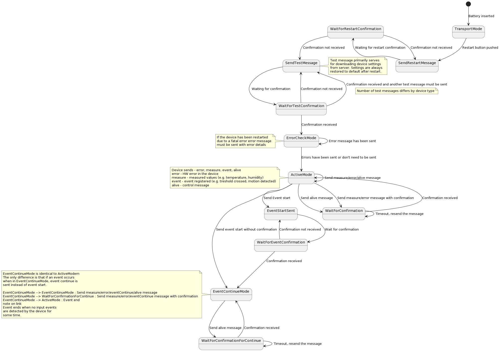

# Device communication

This document is used to describe the behaviour of each device and to describe a common communication protocol.

## Basic device features

 - The devices communicate with the server using a [LoRa](https://en.wikipedia.org/wiki/LoRa) or [NB-IoT](https://en.wikipedia.org/wiki/Narrowband_IoT) network. The choice of network depends on the type of equipment you purchase.
 - The devices communicate using a hexadecimal payload. Example: 020902050098434F0000020000.
 - Devices allow to [send](#messages-from-device-to-server) and [receive-messages](#receiving-messages-from-the-server) from the server.
 - The device contains 1 to N-sensors that monitor the environment. Based on the information from these sensors, the device decides what message to send to the server. 

## General device behaviour

Devices send three main types of messages - event, restart and measure. Event messages are sent
whenever the device detects an event (e.g., move device detects motion, water detection device comes into contact with water). Restart messages inform the server that
the device has been restarted. Measure messages are sent at a specific
time interval and send the measured data. An example would be the measured temperature from a temperature device.
A detailed description of these and other messages can be found [here](#messages-from-device-to-server).

Depending on the settings and device type, some messages require acknowledgment from the server. In these
cases, the device waits for a response from the server and resends the message if it does not receive one. Messages that are not confirmed may be lost because the device does not try to resend them. The server does not learn about the contents of the lost messages, but it can determine that messages have been lost based on discrepancies between the message counter on the server and the [header counter](#0th-byte---counter-of-sent-messages) of subsequent messages.

Some messages may arrive on the server more than once. The server can detect duplicates using [header counter](#0th-byte---counter-of-sent-messages).

In addition to acknowledgment, the device can receive settings and commands from the server.
For more on this news, see [here](#receiving-messages-from-the-server).

## Restart and start of the device

Newly manufactured devices are always switched to transport mode. This mode is designed to put minimal load on the battery
and is primarily used for transportation. The device does not send any messages in transport mode and all its sensors are disabled.

To wake up the device from the transport mode, the restart button must be pressed. After pressing the reset button, the device performs the following steps:

1. LED flashes 1x to indicate restart
2. The LED flashes 1x to indicate the end of initialization
3. [Check battery status](#check-battery-status)
4. Sending [restart message](#restart)
5. Send 0-N [test messages](#test) (depending on device type)
6. Normal operation of the device - sending events, measure messages and more

Once the device is restarted, it can be restarted at any time in two ways - a standard restart or a hard
restart.

### Standard restart

The standard restart is triggered by pressing the button,
[server command](#structure-of-messages-received-from-the-server) or a device error.

After the device is restarted, it performs the following steps (if no error occurs):

1. LED flashes 1x to indicate restart
2. The LED flashes 1x to indicate the end of initialization
3. [Check battery status](#check-battery-status)
4. Sending [restart message](#restart)
5. Sending [error message](#error) (if the restart was triggered by an error)
6. Send 0-N [test messages](#test) (depending on device type)
7. Normal operation of the device - sending events, measure messages and more

A standard restart sets all information that the device keeps in memory to the default value.
The exceptions are two pieces of information - the device mode and the restart counters in the [restart message](#restart).

Any configurations that were set by messages from the server are deleted. So are all the counters in the messages.

### Hard restart

A hard restart occurs by removing the battery or by completely discharging the battery and then draining the device's capacitors.
Capacitors in devices vary according to the device network used. For a hard restart, you need to proceed as follows:

* For LoRa devices, simply remove the battery and insert it back in
* For NB-IoT devices, you need to remove the battery by pressing the restart button and then reinsert the battery

After the device is restarted, it performs the following steps (if no error occurs):

1. LED flashes 1x to indicate restart
2. The LED flashes 1x to indicate the end of initialization
3. LED flashes 10 times to indicate the transition to transport mode
4. Sending [transport message](#transport)
5. Go to [transport mode](#transport-mode)

A hard restart sets all information that the device keeps in memory to the default values.

If a battery is inserted into the device that is not fully charged (2.5 V - 2.9 V), the device detects an error and behaves according to
the description in section [Fatal error](#fatal-error) - for error number 2. The device does not switch into [transport mode](#transport-mode).

If the device detects any other error, the device follows the information described in the section on [error messages].

### Check battery status

The device checks the battery status during restart or initialization. If the battery voltage is below 2.5 V, the device will switch to transport mode.

The battery status is also checked every time the device sends a message or measures data. In this situation,
if a low battery is detected, the device switches to transport mode.

### Transport mode

Transport mode is a special state of the device in which the device does not communicate and saves the battery. Usually used for transporting or storing devices.

## Device state diagram

The following diagram describes the states that the device can get into. Most devices do not support all
states, but only support a subset of this almost complete status automaton. Details of the individual
devices can be found [here](#device).

The state machine does not contain a restart transition. The device can restart in any state.

The state machine also does not take into account the receipt of messages from the server.

## Diode

All devices have a notification LED that informs the user of various events. The following table
describes the events when the diode flashes:

| Number of flashes | Event                                                                            |
|-------------------|----------------------------------------------------------------------------------|
| 1x                | [Restart](#standard-restart)                                                     |
| 1x                | [Start of inicialization](#standard-restart)                                     |
| 10x               | Transition into [transport mode](#transport-mode)                                |
| 1x                | Before transmitting an event                                                     |
| 6x                | When a message fails to transmit for the 3rd time                                |
| Ntimes            | When an error occurs (number of flashes depends on type of [error](#error)   |

## Messages from device to server

Messages are sent in hexadecimal format and consist of two parts - the header and the data.
The header contains general information and the message type. The message type then determines
how the data part of the message will look like.

## Header

The header has 7 bytes and contains general information that is common to all message types.
Example: 0209020. The following table contains an abbreviated description of the header. General description for
individual bytes follows in the following paragraphs.

| Position  | Abbreviated description                                                                                   |
|-----------|-----------------------------------------------------------------------------------------------------------|
| 0th byte    | Counter of sent messages                                                                                  |
| 1st byte    | Counter of received messages                                                                              |
| 2nd byte    | Battery voltage in the device                                                                             |
| 3rd byte    | Processor temperature                                                                                     |
| 4th byte    | RSSI                                                                                                      |
| 5th byte    | 0th bit - Request for message acknowledgement, 1st bit - disconect Remaining bits - number of attempts to send a message |
| 6th byte    | Not used                                                                                                  |
| 7th byte    | Message type                               

### 0th byte - counter of sent messages

The device will increment the counter by 1 each time a new message is sent.
If the counter takes the value 255, it is set to 0 the next time the message is sent.

The counter does not increment if the device tries to resend a message that has not been confirmed.

The primary purpose of the counter is to provide [idempotence](https://en.wikipedia.org/wiki/Idempotence) on the server.

Example:

| Message number| Value of 0th byte                                    |
|---------------|------------------------------------------------------|
| 1             | 00  (remainder of header is ommitted for simplicity) |
| 2             | 01                                                   |
| 3             | 02                                                   |
| 255           | 254                                                  |
| 256           | 255                                                  |
| 257           | 00  (overflow occured and the counter is reset)      |

### 1st byte - counter of received messages

Set to 0 as default. After receiving a message from the server, it is set to the value received in the message from the server. More about this value [here](#0th-byte---identifier).

### 2nd byte - battery voltage in the device

Specifies the battery voltage value. If the device is powered from a socket it contains the voltage value of the power supply.

The voltage can range from 1.8 V to 4.35 V. A value of 0 corresponds to a voltage of 1.8 V and a value of 255 corresponds to a voltage of 4.35 V.

The current voltage can be calculated by the following formula: *received value in the message* / 100 + 1.8

### 3rd byte - processor temperature

Determines the processor temperature. This byte can take the value 0-160 and 255. The current temperature is calculated using the following formula: *current temperature* = *received value in the message* - 40.
If the temperature is higher than 120°C the sensor sends the value 0xFF (255). The total temperature range measured is -40 °C to 120 °C.

The device will never send a value of 161 to 254 that corresponds to temperatures higher than 120 °C.

### 4th byte - RSSI

Contains the [RSSI](https://en.wikipedia.org/wiki/Received_Signal_Strength_Indication) value measured when the previous message was sent.

### 5th byte - acknowledgement and number of attempts to send a message

This byte contains more information about the message being sent. The contents of the byte vary depending on whether the device is using an NB-IoT or LoRa network.

#### 5th byte - LoRa

The byte contains information about the number of failed sends. The following table explains byte composition:

| Positions | Short description |
|---------|-----------------------------------------|
| 0th bit   | Not used                                |
| 1st bit   | Not used                                |
| 2nd-7th bit | Number of attempts to send a message |

In the LoRa network, the device communicates with the network server, which then forwards messages to the server.
If the device fails to send a message to the network server, it will increase the "Number of attempts to send a message"
and try to send the message again after a certain time.

After a certain number of unsuccessful sends, the device waits an increasingly long time before sending another message.

The following table describes the value of the 5th byte in relation to the send attempt.

| Transmission attempt    | Value of 5th byte | Description                                                                                                                      |
|----------------------|----------------|----------------------------------------------------------------------------------------------------------------------------|
| 1st transmission attempt  | 000000--       | Device transmited 1st message. A dash represents two bits with no informational value. |
| 2nd  transmission attempt  | **000001**--   | Device waited for 3 s for acknowlegement from the network server. Repetition counter (bold) was incremented by 1.|
| 3rd  transmission attempt  | 000010--       | Device waited for 3 s for acknowlegement from the network server and the waiting period is going to increase for the following attempts.                            |
| 4th  transmission attempt  | 000011--       | Device waited for 15 min and the waiting period is going to increase for the following attempts.                                                        |
| 5th  transmission attempt  | 000100--       | Device waited for 15 min for acknowlegement from the network server.                                                                     |
| 6th  transmission attempt  | 000101--       | Device waited for 15 min for acknowlegement from the network server.                                                                     |
| 7th  transmission attempt  | 000110--       | Device waited for 60 min for acknowlegement from the network server.                                                                     |
| 8th  transmission attempt  | 000111--       | Device waited for 60 min for acknowlegement from the network server.                                                                     |
| 29th  transmission attempt | 011101--       | Device waited for 60 min for acknowlegement from the network server.                                                                     |
| 30th  transmission attempt | 011110--       | Device had waited waited until the next [alive message](#alive) was to be transmitted.  It then transmitted this message instead of the alive message. |
| 31st  transmission attempt | 011111--       | Device waits until the next alive message is to be sent.                                                                  |

The device waits until it is time to send the [alive message](#alive) before any other attempt to perform sending. The device tries to send the same message over and over again until it is restarted (battery drain or manual reset).

**The device ignores the request to send any other message until
the current message is delivered.**

#### 5th byte - NB-IoT

This byte contains two pieces of information. The following table explains byte composition:

| Position  | Abbreviated description                       |
|-----------|-----------------------------------------------|
| 0th bit   | Request for message acknowlegement by server  |
| 1st bit   | Not used                                      |
| 2-7th bit | Number of message transmittion attempts       |

If the 0th bit is set to 1 the device requires an acknowledgement message.
The device waits 3s after sending and in this window
an acknowledgment, configuration message, or command must come from the server. For more on sending messages
to the device, see [here](#receiving-messages-from-the-server).

If the confirmation message does not arrive within 3 seconds, the device will increase the "Number of attempts to send a message"
and try to send the message again after a certain time.

The following table describes the 5th byte value in relation to the send attempt.

| Transmission attempt     | Value of 5th byte | Description                                                                                                                                      |
|----------------------|----------------|--------------------------------------------------------------------------------------------------------------------------------------------|
| 1st  transmission attempt  | 000000-**1**   | Device transmitted a message and requires an acknowledgment (bold bit). A dash represents two bits with no informational value. |
| 2nd  transmission attempt  | **000001**-1   | Device waited for 3 s. Repetition counter (bold) was incremented by 1.  |
| 3rd  transmission attempt  | 000010-1       | Device waited for 3 s and the waiting period is going to increase for the following attempt. |
| 4th  transmission attempt  | 000011-1       | Device waited for 15 min.                                               |
| 5th  transmission attempt  | 000100-1       | Device waited for 15 min.                                               |
| 6th  transmission attempt  | 000101-1       | Device waited for 15 min.                                               |
| 7th  transmission attempt  | 000110-1       | Device waited for 60 min.                                               |
| 8th  transmission attempt  | 000111-1       | Device waited for 60 min.                                               |
| 29th  transmission attempt | 011101-1       | Device waited for 60 min.                                               |
| 30th  transmission attempt | 011110-1       | Device had waited waited until the next [alive message](#alive)  was
to be transmitted. It then transmitted this message instead of the alive message.               |
| 31st  transmission attempt | 011111-1       | Device waits until the next alive message is to be sent.                |

The device waits until it is time to send the [alive message](#alive) before any other attempt to perform sending. The device tries to send the same message over and over again until it is restarted (battery drain or manual reset).

**The device ignores the request to send any other message until
the current message is delivered.**

### 6th byte - unused

### 7th byte - message type

The message type determines the content of the other bytes in the message. The following table lists the values
this byte can take on:

| Value   | Message type        |
|---------|---------------------|
| 1       | DownlinkAcknowlege  |
| 2       | Restart             |
| 3       | Test                |
| 4       | Error               |
| 5       | Event               |
| 7       | Alive               |
| 8       | Transport           |
| 9       | Measure             |

Downlink and Acknowledge, Restart, Test, Error, Alive, Transport and Event have the same content for all devices.
These messages are described in the following paragraphs on data.

The Measure message informs about the measured value (e.g. temperature at the thermometer).
Measure varies by device type and is described later in this document under the description of each
[device](#device).

## Data

The following paragraphs describe the data part of the message. All of these messages begin with a common
header which is [described above](#header).

### Acknowledging a message from the server

The device sends an acknowledgement message from the server whenever it receives a configuration or command from the server.
This message serves as an acknowledgement. For more information about sending a message from the server, see [here](#receiving-messages-from-the-server).

In the header it is marked with the value 0x01 in the 7th byte (Message type).

Content:

| Byte   | Description                       |
|--------|------------------------------|
| 0th byte | Not used, always 0xFF |
| 1st byte | Not used, always 0x00 |

### Restart

It is always sent after [device restart](#restart-and-start-of-the-device).
 
In the header it is marked with the value 0x02 in the 7th byte (Message type).

Content:

| Byte    | Description                   |
|---------|-------------------------------|
| 0th byte  | Not used, always 0xFF       |
| 1st byte  | Not used, always 0x12       |
| 2nd byte  | Device type                 |
| 3rd byte  | Device mode                 |
| 4th byte  | Not used                    |
| 5th byte  | Not used                    |
| 6th byte  | Not used                    |
| 7th byte  | Not used                    |
| 8th byte  | Not used                    |
| 9th byte  | Not used                    |
| 10th byte | Not used                    |
| 11st byte | Not used                    |
| 12th byte | number of restarts          |
| 13th byte | restart code                |

The device type and mode identifies the device and its internal settings. Details about the type
and mode are described for each [device](#device).

The number of restarts indicates how many times the device has been restarted since [hard-restart](#hard-restart).

The restart code indicates the reason why the restart occurred. Byte can take the following values:

| Value | Description                                                                 |
|---------|---------------------------------------------------------------------------|
| 1       | Restart triggered by error                                                |
| 2       | Restart triggered by [receiving of a message from the server](#receiving-messages-from-the-server) |
| 8       | Restart triggered reset button                                            |

### Test

The test message is sent after the device sends a restart message. The primary goal of the test messages is to receive the settings from the server at the LoRa network before the device starts to function normally. You can find more about this issue on the LoRa network [here](#lora). Another use can be signal control.

The default setting for most devices is to send one test message.
How many test messages the device sends is described for each [device](#device).

The device always waits 1 minute after sending a restart message and then sends a test message.
There is a delay of 1 minute between every two test messages.

Content:

| Byte   | Description             |
|--------|-------------------------|
| 0th byte | Not used, always 0xFF |
| 1st byte | Not used, always 0x00 |

### Error

An error message is sent from the device if a hardware error occurs.

Content:

| Byte                  | Description                           |
|-----------------------|---------------------------------------|
| 0th byte              | Error type                            |
| 1st byte              | Not used, always 0x04                 |
| 2nd byte - 5th byte   | Contains error register value         | 

Errors are divided into two types - fatal and standard. Standart errors have a value of 0th byte
set to 0 and fatal ones are set to 1.

The error register contains information about which specific errors occurred.

#### Standard errors

If a standard error occurs, the device sends an error message and does not restart. If a normal error message is detected and sent 5 times, a fatal error is triggered.

When a standard error is detected, the LED always flashes 3 times.

| Error register                      | Description      |
|-------------------------------------|------------------|
| 00000000 00000000 00000000 00000000 | I2C Error        |
| 00000000 00000000 00000000 00000001 | UART Error       |
| 00000000 00000000 00000000 00000010 | EEPROM Error     |
| 00000000 00000000 00000000 00000100 | sensor Error     |
| 00000000 00000000 00000000 00001000 | actuator Error   |

#### Fatal error

If a fatal error occurs on the device, the device will reset and send an error message.
It then proceeds as normal - it sends a test message and then sends other messages depending on the type of device.

The error register contains information about what error occurred. The following table describes
the values and their meanings:

| Error register                      | Description                                                                       | Number of LED flashes|
|-------------------------------------|-----------------------------------------------------------------------------------|----------------------|
| 00000000 00000000 00000001 00000000 | 1 - Radio isn't working correctly                                                 | 3x                   |
| 00000000 00000000 00000010 00000000 | 2 - Inserted battery isn't fully charged. Checked only after hard restart.        | 4x                   |
| 00000000 00000000 00000100 00000000 | 3 - Main state machine is in an undefined state.                                  | 3x                   | 
| 00000000 00000000 00001000 00000000 | 4 - Device cannot connect to the network after standart restart.                  | 6x                   |
| 00000000 00000000 00010000 00000000 | 5 - Standard error occured 5*                                                     | 3x                   |

If error numbers 1,3 and 5 occur 4 hours after restart, the device proceeds as follows:

1. The LED flashes X times in 10 cycles (according to the table) to indicate an error.
2. The device restarts and continues to operate as if it were [restarted](#standard-restart)
3. If the error still persists, the error processing is repeated

If the error number 1,3,4 and 5 occurs within 4 hours of restart, the device proceeds as follows:

1. The LED flashes X times in 10 cycles (according to the table) to indicate an error.
2. The device will check if 4 hours have passed since the restart.
3. If the time has not passed, it is put to sleep for 2 minutes and then repeats points 1 and 2.
4. If the time has passed, the device restarts and continues to function as if it were [restarted](#standard-restart).
5. If the error still persists, the error processing is repeated again.

For error number 2, the device behaves according to the following list:

1. The user invokes [hard restart](#hard-restart).
2. The LED will flash 1x to indicate a restart.
3. The LED will flash 1x to indicate initialization.
4. The device detects in initialization that the battery is not fully charged.
5. The LED flashes 4 times in 10 cycles (according to the table) to indicate an error.
6. The device performs point 5 at two-minute intervals for the following 4 hours.
7. The device restarts.
8. The LED will flash 1x to indicate a restart.
9. The LED will flash 1x to indicate initialization.
10. The initialization is completed. Error 2 detection (Inserting a battery that is not fully charged) no longer occurs.
11. The device sends a restart message.
12. The device sends an error message.
13. The device sends a test message.
14. The device operates in the normal way.

### Alive

The Alive message serves as a notification that the device is OK and still transmitting. The Alive message
is sent only if the device has not communicated for a long time. By default, an alive message is sent if the device has not sent any message for 12 hours. The interval can be set using [server command](#alive-messages-period).

Content:

| Byte     | Description                  |
|----------|------------------------------|
| 0th byte | Not used, always 0xFF        |
| 1st byte | Not used, always 0x00        |

### Transport

The transport message is sent when the device is switched to [transport mode](#transport-mode). The Transport mode is
a special state of the device in which the device does not communicate and saves the battery. It is usually used for
device transport or storage.

| Byte   | Description             |
|--------|-------------------------|
| 0th byte | Not used, always 0xFF |
| 1st byte | Not used, always 0x00 |

### Event

The Event message indicates that the device has experienced some form of
an event. What events the device responds to varies by device type.
For example, a device that detects motion sends an event message when
detecting a motion.

Some devices can also detect device cover opening or free fall.
  The following paragraphs describe the event message in general terms.
In [the following section of the documentation](#device) the individual
devices and their behaviour are described.

The null byte in the message specifies the type of event that occurred.

| Byte   | Description                                 |
|--------|---------------------------------------------|
| 0th byte | Event type - start, continue, end, tamper |

The values of the null byte can be as follows:

| Value | Event    |
|---------|----------|
| 0       | start    |
| 1       | continue |
| 2       | end      |
| 3       | tamper   |

#### Event start, continue and end

If the main sensor on the device detects an event, it sends an event start message.
It then waits 10 minutes to record data about the next possible event. If no further events occur during this time period, the device sends an event end message. Otherwise, it sends an event continue message, waits another 10 minutes and repeats the procedure.

Exactly what the alarm is varies by device. This can be to record the movement of the device (Move),
water detection (Water) or for example motion detection in the room (PIR). A more detailed description of the operation is described in the [Devices](#device) section.

Some devices do not send all types of events or behave
differently. More about these differences in the [Devices](#device) section.

Event start, end and continue have the following format:

| Byte   | Description                              |
|--------|------------------------------------------|
| 1st byte | Not used, always 0x03                  |
| 2nd byte | Number of events                       |
| 3rd byte | Time since last event in seconds       |

The number of events indicates how many events have occurred since the previous message was sent.
For event end this value is always 0 and for event start this value is
always 1.

Time since last event indicates the time when the device last
recorded an event. For event start this value is always 0, as it is sent
immediately after the event is recorded by the device. For the continue event, the value is
always 0-10 minutes, since the device sends a continue event
every 10 minutes and the sensor could have recorded the event at any time during this period.  
For event end, this value is always greater than 10 minutes.

#### Event tamper

This type of alarm indicates that the device cover has been opened or closed.
Event format

| Byte   | Description                       |
|--------|------------------------------|
| 1st byte | Not used, always 0x03 |
| 2nd byte | 0 - Not used                |
| 3rd byte | 0 - Not used                |

## Device

The following paragraphs describe the individual devices and their behaviour.

### Water detector

The device is used to detect water that the device has come into contact with. Event start is sent when the device is flooded with water. If the device detects water in the next 10 minutes,
the event continue message is sent. Event end message is sent if
no water is detected for 10 minutes.

* The device supports events - Event start/continue/end, Restart, Alive, Transport, Error, DownlinkAcknowlege.

The water device has a maximum number of event continue messages set compared to other devices.
The device always sends only 2 continue messages and then waits for the alarm to end, i.e. it does not send any more continue messages.

### Motion detector

The device is used to detect the movement of the device itself of the object on which the device is placed. Event start message is sent when the device detects motion. Event continue message is sent if another movement is detected in the next 10 minutes.
An event end message is then sent if the device does not detect any movement for 10 minutes.

* The device supports events - Event start/continue/end, Restart, Alive, Transport, Error, DownlinkAcknowlege.

### Magnetic detector

The device is used to monitor the frequency of opening/closing of doors, covers, passage of moving parts by monitoring the magnetic field of the magnet.
The device supports two modes. Continuous and simple mode. You can switch between these modes
using the [device mode setting server message](#setting-device-mode). Default mode is simple.

* The device supports events - Event start/continue/end, Restart, Alive, Transport, Error, DownlinkAcknowlege.

#### Continuous mode

If the magnet is delayed in the idle state, an Event start message is sent.
It does not react to the magnet's approach, but it counts each magnet approaching
and sends an Event continue message after 10 minutes.
If nothing happens within 10 minutes (the magnet is not moved away),
the device sends an Event end message.

#### Simple mode

Each magnet delay sends an Event start message. Each magnet delay sends an Event end message. In this mode, no alarms are counted or Event continue messages are sent.

### PIR detector

Detects human movement or presence in a defined area up to 10m away using a passive infrared detector. When motion is detected by the sensor, the device sends an Event start message.
If it continues to detect motion, it sends Event continue messages at 10-minute intervals.
   The sensor sends an Event end message if no movement occurs for 10 minutes.

* The device supports events - Event start/continue/end, Restart, Alive, Transport, Error, DownlinkAcknowlege.

### SOS button

A device with a button to call for help or raise an alarm.
The device sends an Event start message if someone presses the button.
The event end message is never sent.

* The device supports events - Event start, Restart, Alive, Transport, Error, DownlinkAcknowlege.

### Thermometer

It measures the temperature at given moments (default after 1 min). After X measurements (default 10), it calculates the average value and sends a Measure message to the server.

* The device supports events - Measure, Restart, Alive, Transport, Error, DownlinkAcknowlege.

Measure message of the Thermometer device has the following format:

| Byte                  | Description            |
|-----------------------|------------------------|
| 0th byte              | Not used - always 0xFF |
| 1st byte              | Not used - always 20   |
| 2nd byte - 21st byte  | Measured temperatures  |

2nd byte - 21st byte contains the last 9 values sent to the server and one
new value. Historical values are included in the message due to the possibility of losing the message. The server can then use these values during an outage.

The messages are sorted from the most recent measurement to the oldest.

Each measured value in the message occupies 2 bytes and is coded using a two's complement - 1 in the highest bit indicates a negative number and 0 indicates a positive number. To obtain the temperature, the SS needs to calculate the two's complement and divide the result by 100. For example, if byte 2 contains - 0x01 and byte 3 contains 0x00, the measured temperature = (256/100) or 2.56 °C. If the second byte contains 10000001 (0x81) and the third 0x00 then the measured temperature = (256/100) * - 1 or -2.56 °C.

The device allows you to set how often the measure message should be sent and also
how many samples should be measured in a given interval.
The default setting is 10 minutes and 10 samples. The device measures the temperature every minute
and after 10 minutes sends the average of the measured temperatures together with the 9 previous
sent temperatures. How often the messages should be sent and how many times the temperature should be measured in this interval
can be set by a command from the server. Read more [here](#sampling-period-for-temperature-and-humidity-devices-and-how-often-to-send-a-measure-message).

### Hygrometer/Thermometer

It measures temperature and humidity at given moments (default after 1 min). After X measurements (default 10), it calculates the average value and sends a Measure message to the server.

* The device supports events - Measure, Restart, Alive, Transport, Error, DownlinkAcknowlege.

The Measure message has the following format:

| Byte             | Description                         |
|------------------|--------------------------------|
| 0th byte         | Not used - always 0xFF |
| 1st byte         | Not used - always 30   |
| 2nd byte - 31st byte | Measured values of temperature and humidity    |

The device works similarly to the Thermometer described [here](#thermometer). The only
difference is that it sends temperature and humidity. Each measured value has a length of
3 bytes, where the first two bytes determine the temperature and the third byte determines the humidity.

The humidity is determined in % and can range from 0-100.

## Receiving messages from the server

The device can receive messages from the server. These messages can be divided into confirmation, configuration settings and commands. Confirmation is used to confirm messages from the device. Configuration settings allow you to set the device configuration and commands allow you to control the device in certain ways, such as forcing a restart.

All messages are [idempotent](https://en.wikipedia.org/wiki/Idempotence). The server can send the same message several times and the result will be the same. Idempotency is ensured by the nature of the messages, i.e. the device processes the message several times,
but all the commands and settings are created to avoid errors.

If the device successfully receives a configuration or command message, it sends back an acknowledgement to the server. The format of the confirmation message sent by the device is described [here](#acknowledging-a-message-from-the-server).

The device always sends the acknowledgement and receipt first and then processes the command, e.g. if
the device receives a restart command, it sends the acknowledgement first and then restarts.

## LoRa and NB-IoT

The devices communicate over a LoRa or NB-IoT network. Sending messages to the device varies depending on which network the device uses. The network is selected when the device is manufactured and cannot be changed.

### NB-IoT

Whenever a device sends a [message requiring confirmation](#acknowledging-a-message-from-the-server), the server has the option to send
a message to the device. The device waits 5 seconds for a message from the server. The server must respond
with a command, configuration setting, or [confirmation](#message-acknowledgment) if it does not want to change anything on the device.
If the device does not receive any message within 5 seconds, it resends the original
message, more [here](#5byte---confirm-disconnect-and-number-of-attempts-to-send-message).

If the server sends multiple messages at once, the device will only process the first message
and ignores others.

For simplicity of implementation on the server, it is possible to acknowledge all received
messages. If the device does not require an acknowledgement, but the server sends one, the
acknowledgment is ignored.

The following diagrams show sending a command or configuration
messages to the device. An uplink is any message sent from a device to a server. A downlink is any message sent from a server to a device.

A situation where an acknowledgment message is lost:

### LoRa

In a LoRa network, the device communicates with a network server that takes care of sending messages
to the server and to the device. It acts as an intermediary between the server and the device.

If the server wants to send a message to the device, it must send it to the network server.
The network server saves the message and then waits until the device sends the message. Then,
it receives a message from the device and sends it to the server. At the same time it sends a message to the server,
it sends a message to the device.

The following diagrams show sending a command or configuration
messages to the device. An uplink is any message sent from a device to a server. A downlink is any message sent from a server to a device.

Network north must always wait for the device to start communication. Therefore, it may happen
that a message from the server is delivered after a long time.

If the device successfully receives the message, it sends an acknowledgement to the server.
  The format of the confirmation message is described [here](#message-acknowledgment).

There is no point for the LoRa network to send an acknowledgement message to the device, even if the device [requests it](#header),
since the LoRa network takes care of the acknowledgement automatically for all messages.

In some situations, the device must re-establish communication with the network server.
Re-establishing the connection causes the messages that are stored on the network server
to be deleted. Re-establishing communication happens whenever the device is restarted, when
the radio modem is [restarted](#radio-restart) and in some cases when a message repeatedly fails to be delivered.

Multiple messages can be sent to the LoRa network server at the same time.
This functionality is usually not needed, but it is possible to implement it
and use [message-received-counter](#1st-byte---counter-of-received-messages) to identify which message
the device is acknowledging.

#### Implementation of sending messages to devices in LoRa network

We can implement sending messages to devices in the LoRa network
in several ways. The simplest way is "marking messages". In this
implementation, the server sends the downlink and marks it as
"sent". After it receives the first uplink since the downlink was sent, it changes the status of the sent downlink to "will be acknowledged in the next message". There should be an uplink with acknowledgment in the next message. If a downlink message arrives, it is successfully sent.

The following diagram shows the behaviour when a device
performs a join (re-establishing communication with the network server) and deletes a message that is waiting on the network server:

The disadvantage of this solution is that it may take a long time to deliver the message when a new
connection to the network server is established. We can speed up the delivery of the message
by immediately resending the current message waiting for acknowledgment when a reset message arrives on the server,
without waiting for another message. We can do this acceleration
because we know that a reset will always cause messages on the network server to be deleted.

## Structure of messages received from the server

Messages are divided into header and data. The header is common for all messages and the data part differs
according to the value of the 4th and 5th byte.

### Header of the message received from the server

#### 0th byte - identifier

Message identifier. The value that the server sends in this byte is copied
and returned in the value [1st byte - counter of received messages](#1st-byte---counter-of-received-messages). This value can serve as a message identifier
that have been received by the device.

If the server never sends more than one message at a time, this identifier
is not needed.

#### 1st byte

Unused.

#### 2nd byte

Unused.

#### 3rd byte

Unused.

#### 4th byte - message category

This byte specifies the category of the downlink to be sent. The category can take on the following values:

| Value of header's 4th Byte | Description             |
|----------------------------|-------------------------|
| 0x01                       | Message acknowledgement |
| 0x02                       | Commands                |
| 0x04                       | Settings                |

The chapters below describe the different categories and types of messages they can contain.

#### 5th byte - message type

Common with the message category identifies what the data part of the message will look like.

### Data

The data part is divided into three categories - message acknowledgment, commands and settings. The following chapters describe these
categories and messages they may contain.

#### Categories - message acknowledgment

The category is identified by the value 0x01 in the 4th Byte of the header and contains the following message types:

| Value of header's 5th byte | Description                                                 |
|----------------------------|-------------------------------------------------------------|
| 0x01                       | Message acknowledgement                                     |

#### Message acknowledgment

The message is identified by the value 0x01 in the 5th byte of the header.

The message is used to acknowledge the message that came from the device. Message acknowledgment
only needs to be sent if the device uses the NB-IoT network and requests it in the [header of the sent message](#header).

By default, the following messages must be acknowledged: Event start, Alive, Reset. In addition,
the thermometer and hygrometer must have acknowledged every sixth message since the last confirmed message. For other devices,
every seventh message since the last message being acknowledged must be acknowledged.

Structure:

| Byte    | Description                    |
|---------|--------------------------------|
| 0th byte| Not used - always 0x00         |

#### Categories - commands

The category is identified by the value 0x02 in the 4th byte of the header and contains the following message types:

| Value of header's 5th byte    | Description                             |
|-------------------------------|-----------------------------------------|
| 0x02                          | Device restart                          |
| 0x03                          | Device switched into the transport mode |
| 0x04                          | Modem restart                           |

##### Device restart

The device restarts.

Structure:

| Byte    | Description                    |
|---------|--------------------------------|
| 0th byte| Not used - always 0x00         |

##### Switching the device into transport mode

The device switches to [transport mode](#transport-mode).

Structure:

| Byte    | Description                    |
|---------|--------------------------------|
| 0th byte| Not used - always 0x00         |

##### Radio restart

Restarts the device's radio modem.

Structure:

| Byte    | Description                    |
|---------|--------------------------------|
| 0th byte| Not used - always 0x00         |

#### Categories - settings

The category is identified by the value 0x04 in the 4th byte of the header and contains the following message types:

| Value of header's 5th byte | Description                                              |
|-------------------------|-------------------------------------------------------------|
| 0x01                    | Number of consecutive messages not requiring acknowledgement|
| 0x02                    | Turning message acknowledgement on/off                      |
| 0x03                    | Turning Event start acknowledgement on/off                  |
| 0x04                    | Alive message period                                        |
| 0x05                    | Measure message period                                      |
| 0x06                    | Turning LED flashing and buzzer indication during Event start on/off |
| 0x08                    | Turning LoRa ADR on/off                                     |
| 0x09                    | Setting LoRa dataRate                                       |
| 0x0A                    | Setting device mode                                         |
| 0x0B                    | Limiting the maximum number of Event continue messages      |
| 0x0C                    | Specifies the sampling period for temperature and humidity devices |
| 0x0E                    | Motion detection device sensitivity setting                 |

##### Number of consecutive messages not requiring acknowledgement

Determines message numbers which must always be acknowledged. The default value is 6 for thermometer and hygrometer,
7 for other devices. The default value can be set by sending the value 0xFF in the 1st byte.

Structure:

| Byte   | Description                                                          |
|--------|----------------------------------------------------------------------|
| 0th byte | Not used - always 0x01                                             |
| 1st byte | Number of consecutive messages not requiring acknowledgement, 0 - all messages require acknowledgement |

##### Turning message acknowledgement on/off

Sending this message to the device turns off or on the device's request for message acknowledgement.

Structure:

| Byte   | Description                                          |
|--------|------------------------------------------------------|
| 0th byte | Not used - always 0x01                             |
| 1st byte | 0 turns on message acknowledgement, 1 - turns off message acknowledgement |

##### Turning Event start acknowledgement on/off 

Turns the Event start event acknowledgement off or on.

Structure:

| Byte   | Description                                          |
|--------|------------------------------------------------------|
| 0th byte | Not used - always 0x01                             |
| 1st byte | 0 turns off event acknowledgement, 1 - turns on event acknowledgement |

##### Alive messages period

Sets how long it takes to send an alive message since the last communication.
The default value is 12 hours since the last message was sent.

| Byte     | Description                  |
|----------|------------------------------|
| 0th byte | Not used - always 0x03       |
| 1st byte | Hours                        |
| 2nd byte | Minutes                      |
| 3rd byte | Seconds                      |

##### Measure message period    

Described [here](#sampling-period-for-temperature-and-humidity-devices-and-how-often-to-send-a-measure-message).

##### Turning LED flashing and buzzer indication during Event start on/off

| Byte   | Description                    |
|--------|--------------------------------|
| 0th byte | Not used - always 0x01       |
| 1st byte | Contains settings            |

Composition of 1st byte:

| Bit               | Description |
|-------------------|-------------|
| 0th bit           | LED         |
| 1st bit           | Not used    |
| 2nd bit           | Buzzer      |
| 3rd bit           | Not used    |
| 4th bit - 7th bit | Not used    |

By default, the byte is set to 10100000 - both flashing and beeping are enabled during Event start.

##### Turning LoRa ADR on/off

Turns off or on [Lora ADR](https://lora-developers.semtech.com/documentation/tech-papers-and-guides/understanding-adr/)
.
It can only be used for devices on the LoRa network.

| Byte     | Description                  |
|----------|------------------------------|
| 0th byte | Not used - always 0x01       |
| 1st byte | 0 - off, 1 - on              |

##### Setting LoRa dataRate

Sets [Lora dataRate](https://lora-developers.semtech.com/uploads/documents/files/Understanding_LoRa_Adaptive_Data_Rate_Downloadable.pdf)
.
It can only be used for devices on the LoRa network.

| Byte     | Description                  |
|----------|------------------------------|
| 0th byte | Not used - always 0x01       |
| 1st byte | 0 - off, 1 - on              |

##### Setting device mode

Sets the mode on the device.

If the message is sent to a device that does not support other modes, it will only restart the device.

| Byte     | Description                  |
|----------|------------------------------|
| 0th byte | Not used - always 0x01       |
| 1st byte | Device operation mode        |

Currently only Magnet devices support mode switching (0 - simple, 1 - continuous). When another mode number is sent,
the device is set to continuous mode.

##### Limiting the maximum number of Event continue messages

Sets the maximum number of messages of type [Event continue](#event). The default
value for Magnet, PIR and Move device is unlimited. There are two messages for Water device.

When the device reaches the maximum number, it stops sending Event continue messages. After sending the Event end message and
then a new cycle starting with an Event start message, the device sends Event continue messages again up to
the maximum number.

| Byte     | Description                                                            |
|----------|------------------------------------------------------------------------|
| 0th byte | Not used - always 0x01                                                 |
| 1st byte | Maximal number of Event continue messages. 0x0 sets unlimited number of messages |

##### Specifies the sampling period for temperature and humidity devices

Described [here](#sampling-period-for-temperature-and-humidity-devices-and-how-often-to-send-a-measure-message).

##### Motion detection device sensitivity setting

Sets the sensitivity of the motion detection device.

| Byte     | Description                    |
|----------|--------------------------------|
| 0th byte | Not used - always 0x04         |
| 1st byte | ACC ZERO Setting               |
| 2nd byte | MAG ZERO Setting               |
| 3rd byte | ACC Count Setting              |
| 4th byte | MAG Count Setting              |

The following settings should be sufficient for normal use:

| Sesitivity| 0th byte | 1st byte | 2nd byte | 3rd byte | 4th byte |                      
|-----------|----------|----------|----------|----------|----------|
| Low       | 4        | 100      | 200      | 10       | 5        |
| Medium    | 4        | 75       | 100      | 10       | 5        |
| High      | 4        | 50       | 50       | 10       | 5        |

##### Sampling period for temperature and humidity devices and how often to send a measure message

The values 0x05 and 0x0C both refer to the thermometer and hygrometer and are closely related.
Both of these values must be set at once in the correct order and without restarting between processing of these messages.

First, it must be set how often the measure message should be sent and then what the sampling should be.

The default setting is 10 minutes and 1 minute. The device measures every minute and averages them every 10 minutes and then
sends a measure message.

It is important that the period of sending the measure message is always an integer divisible by the sampling period, otherwise
the device will send the message at the wrong interval.

Both of these values have the following format:

| Byte     | Description                    |
|----------|--------------------------------|
| 0th byte | Not used - always 0x03         |
| 1st byte | Hours                          |
| 2nd byte | Minutes                        |
| 3rd byte | Seconds                        |

If we set the period of sending measure messages to a value that is not divisible by the sampling period,
the device will behave according to the following example:

Let's imagine that we set the measure message period to 10 minutes and the measurement period to 4 minutes.
The device calculates the number of measurements that need to be taken before sending the message as follows:
10 / 4 = 2 (integer division is performed).

The device will then wait 4 minutes between measurements and send a message after every two measurements. Measure
messages will therefore be sent every 8 minutes.
