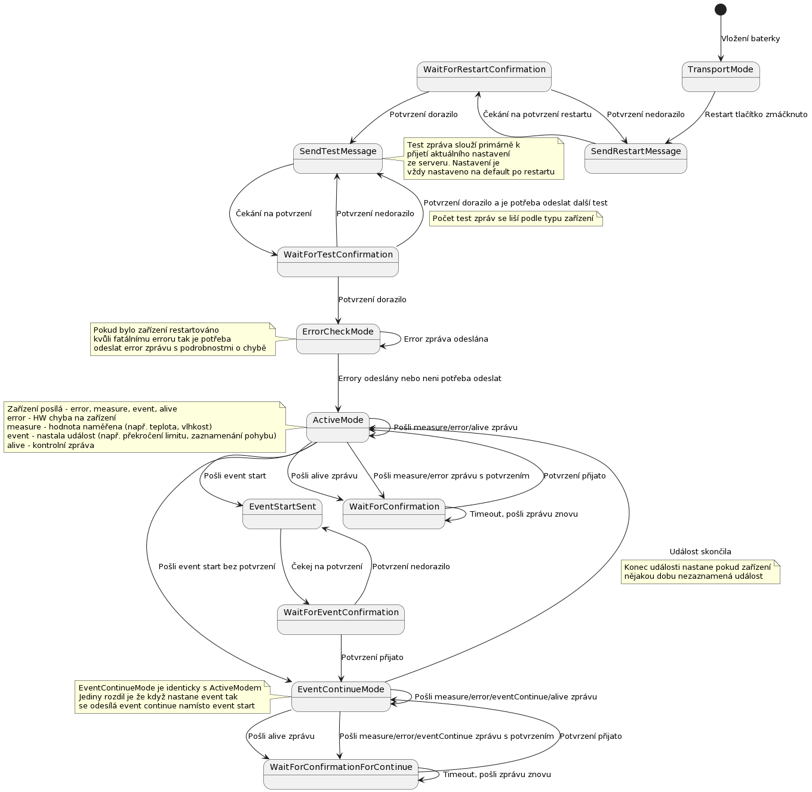
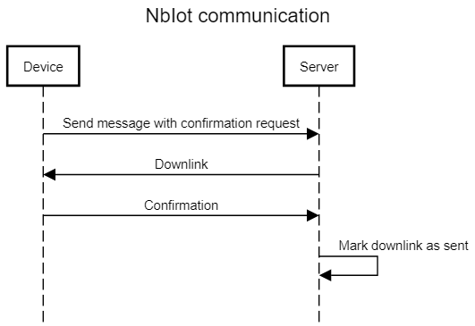
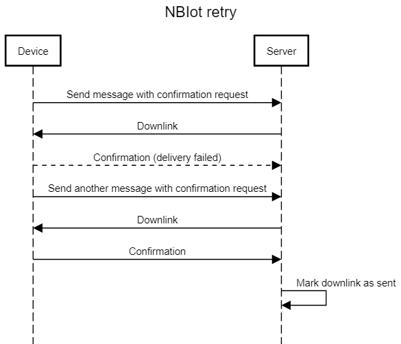
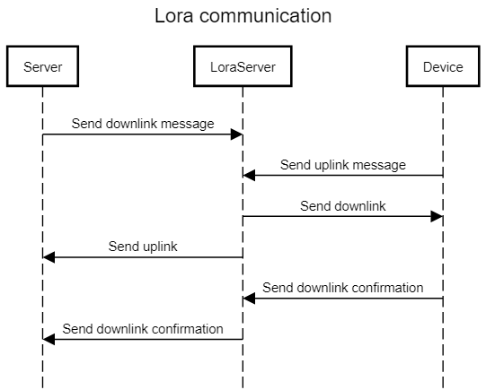
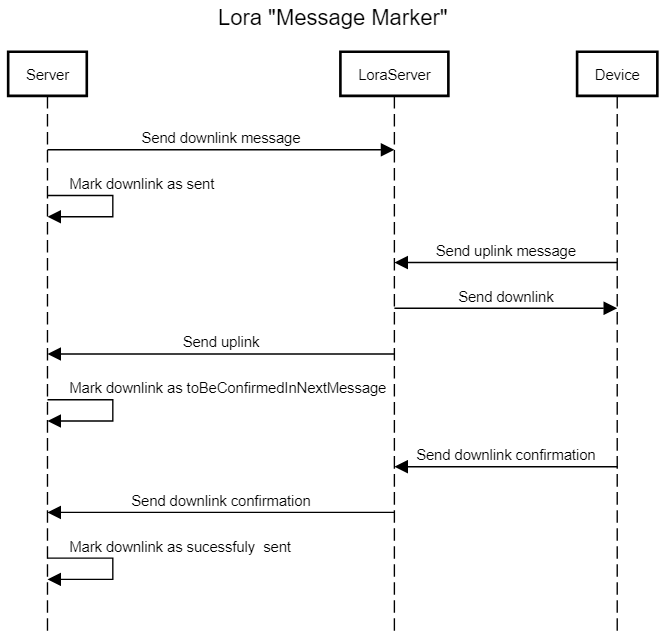
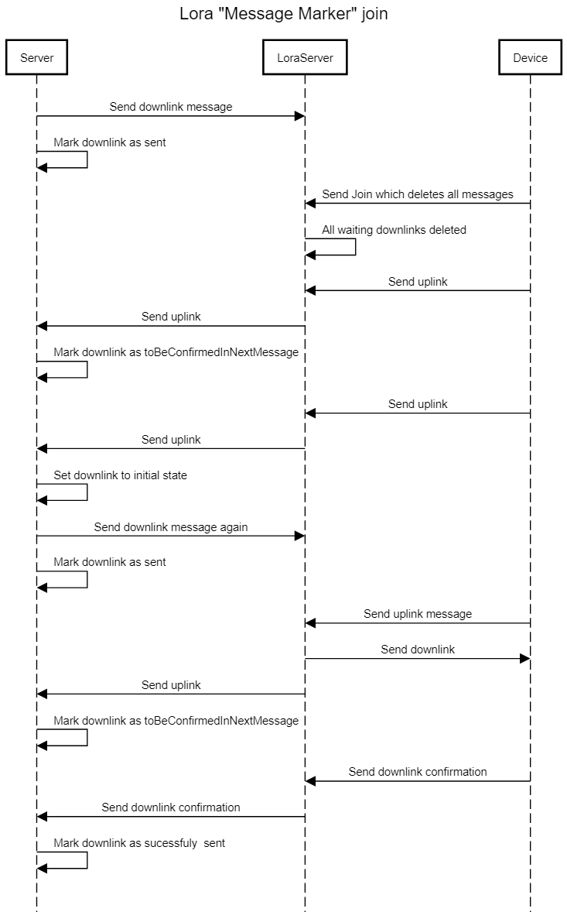

# Komunikace zařízení

Tento dokument slouží k popisu chování jednotlivých zařízení a k popisu společného komunikačního protokolu.

## Základní vlastnosti zařízení

 - Zařízení komunikují se serverem pomocí [LoRa](https://cs.wikipedia.org/wiki/LoRa) nebo [NB-IoT](https://cs.wikipedia.org/wiki/Narrowband_IoT) sítě. Výběr sítě záleží na typu zakoupeného zařízení.
 - Zařízení komunikují pomocí hexadecimálního payloadu. Příklad 020902050098434F0000020000.
 - Zařízení umožňují [odesílat](#zprávy-ze-zařízení-na-server) i [přijmat zprávy](#přijmání-zpráv-ze-serveru) ze serveru.
 - Zařízení obsahuje jeden až N senzorů které sledují okolí. Na základě informací z těchto senzorů se zařízení rozhoduje jakou zprávu bude odesílat na server. 

## Obecné chování zařízení

Zařízení odesílají tři hlavní druhy zpráv - event, restart a measure. Event zprávy jsou odeslány
vždy, když zařízení zaznamená nějakou událost (např. move zařízení zaznamená pohyb, water detection zařízení přijde do kontaktu s vodou). Restart zprávy informují server, že došlo k
restartování zařízení. Measure zprávy jsou odesílány v určitém
časovém intervalu a odesílají naměřená data. Příkladem může být naměřená teplota z teplotního zařízení.
Podrobný popis těchto a dalších zpráv můžete nájít [zde](#zprávy-ze-zařízení-na-server).

Některé zprávy v závisloti na nastavení a typu zařízení vyžadují potvrzení ze serveru. V těchto
případech zařízení čeká na odpověď ze serveru a pokud ji neobdrží, zprávu odešle znovu. Zprávy, které nejsou potvrzovány mohou být ztraceny, jelikož se je zařízení nesnaží odeslat znovu. Server se nedozví o obsahu ztracených zpráv, ale podle nesrovnalostí mezi počítadlem zpráv na serveru a [počítadlem v hlavičce](#0byte---počítadlo-odeslaných-zpráv) následujících zpráv může zjistit, že došlo ke ztrátě zpráv.

Může se stát, že některé zprávy dorazí na server víckrát než jednou. Server může duplicity detekovat pomocí [počítadla v hlavičce](#0byte---počítadlo-odeslaných-zpráv).

Kromě potvrzení dokáže zařízení přijmat nastavení a příkazy ze serveru.
Více o těchto zprávách najdete [zde](#přijmání-zpráv-ze-serveru).

## Restart a spuštění zařízení

Nově vyrobéná zařízení jsou vždy přepnuta do transportního režimu. Tento režim je uzpůsoben tak, aby zařízení minimálně zatěžovalo baterii
a slouží primárně k přepravě. Zařízení v transportním režimu neodesílá žádné zprávy a všechny jeho senzory jsou vypnuté.

Pro probuzení zařízení z transportního režimu je potřeba stisknout restarovací tlačítko. Po stisku resetovacího tlačítka zařízení provede následující kroky:

1. Dioda blikne 1x pro oznámení restartu
2. Dioda blikne 1x pro oznámení ukončení inicializace
3. [Kontrola stavu baterie](#kontrola-stavu-baterie)
4. Odeslání [restart zprávy](#restart)
5. Odeslání 0-N [testovacích zpráv](#test) (podle typu zařízení)
6. Běžné fungování zařízení - odesílání událostí, measure zpráv a dalších

Po spuštění zařízení je možné ho kdykoliv restartovat dvěma způsoby - standartním restartem nebo hard restartem.

### Standartní restart

Standartní restart je vyvolán stisknutím tlačítka,
[příkazem ze serveru](#struktura-zpráv-přijmaných-ze-serveru) nebo chybou v zařízení.

Poté co je zařízení restartováno provádí následující kroky (pokud nedojde k chybě):

1. Dioda blikne 1x pro oznámení restartu
2. Dioda blikne 1x pro oznámení ukončení inicializace
3. [Kontrola stavu baterie](#kontrola-stavu-baterie)
4. Odeslání [restart zprávy](#restart)
5. Odeslání [error zprávy](#error) (pokud byl restart vyvolán chybou)
6. Odeslání 0-N [testovacích zpráv](#test) (podle typu zařízení)
7. Běžné fungování zařízení - odesílání událostí, measure zpráv a dalších

Standartní restart nastaví všechny informace, které zařízení udržuje v paměti, na defaultní hodnotu.
Vyjímkou jsou dvě informace - mód zařízení a počítadla restartů v [restart zprávě](#restart).

Jakékoliv konfigurace, které byly nastaveny zprávami ze serveru jsou  smazány. Stejně tak všechna počítadla ve zprávách.

Restart způsobí přerušení všech procesů. Například pokud je stisknuto tlačítko restart po hard restartu tak se neodešle transport zpráva ale odešle se restart a zařízení se poté chová jako při standartním restartu.

### Hard restart

Hard restart nastává vyjmutím baterie nebo úplným vybitím baterie a následným vybitím kapacitorů zařízení.
Kapacitory v zařízeních se liší podle používané sítě zařízení. Pro hard restart je potřeba postupovat následujícím způsobem:

* Pro LoRa zařízení stačí vyjmout baterii a vložit ji zpět
* Pro NB-IoT zařízení je potřeba vyjmout baterii stisknout restart tlačítko a poté znovu vložit baterii

Poté co je zařízení restartováno provádí následující kroky (pokud nedojde k chybě):

1. Dioda blikne 1x pro oznámení restartu
2. Dioda blikne 1x pro oznámení ukončení inicializace
3. Dioda blikne 10x pro oznámení přechodu do transportního režimu
4. Odeslání [transport zprávy](#transport)
5. Přechod do [transportního režimu](#transportní-režim)

Při hard restartu se na defaultní hodnoty nastaví všechny informace, které zařízení udržuje v paměti.

Pokud je do zařízení vložena baterie, která není plně nabitá (2,5 V - 2,9 V), zařízení detekuje error a chová se podle
popisu v sekci [Fatální chyba](#fatální-chyba) - pro chybu s číslem 2. Zařízení nepřechází do [transportního režimu](#transportní-režim).

Pokud zařízení detekuje jakýkoliv jiný error, tak zařízení postupuje podle informací popsaných v sekci o [chybových zprávách].

### Kontrola stavu baterie

Zařízení při restartu, resp. při inicializaci kontroluje stav baterie. Pokud je napětí baterie nižší než 2,5 V, zařízení se přepne do transportního režimu.

Stav baterie se také kontroluje pokaždé když zařízení odesílá zprávu nebo měří data. Pokud je v této situaci
naměřen nízký stav baterie, tak se zařízení přepne do transportního režimu.

### Transportní režim

Transportní režim je speciální stav zařízení, ve kterém zařízení nekomunikuje a šetří baterii. Obvykle se používá pro přepravu nebo skladování zařízení.

## Stavový diagram zařízení

Následující diagram popisuje stavy, do kterých se zařízení může dostat. Většina zařízení nepodporuje všechny
stavy, ale podporuje pouze podmnožinu tohoto téměř úplného stavového automatu. Podrobnosti o jednotlivých
zařízeních najdete [zde](#zařízení).

Stavový automat neobsahuje restart přechod. Restart zařízení může nastat v jakémkoliv stavu.

Stavový automat také nezohledňuje přijmání zpráv ze serveru.

## Dioda

Všechna zařízení mají notifikační diodu, která informuje uživatele o různých událostech. Následující tabulka
popisuje události při kterých dioda bliká:

| Počet bliknutí | Událost                                                    |
|----------------|------------------------------------------------------------|
| 1x             | [Restartu](#standartní-restart)                            |
| 1x             | [Spuštění inicializace](#standartní-restart)               |
| 10x            | Přechod do [transportního režimu](#transportní-režim)      |
| 1x             | Před odesláním události                                    |
| 6x             | Při třetím neúspěšném odeslání zprávy                      |
| Nkrát          | Při erroru (počet bliknutí závisí na typu [erroru](#error) |

## Zprávy ze zařízení na server

Zprávy se odesílají v hexadecimálním tvaru a skládají se ze dvou částí - hlavičky a dat.
Hlavička obsahuje obecné informace a typ zprávy. Typ zprávy pak určuje
jak bude vypadat datová část zprávy.

> U NB-IoT zařízení, kde je payload zasílán UDP datagramem, může být před samotným payloadem ještě 16 znaků obsahujících identifikátor SIM karty. Viz. [identifikace zařízení](#identifikace-zarizeni) níže.

## Identifikace zařízení
Netlia jako výrobce označuje zařízení sériovým číslem. Toto sériové číslo není žádnou formou možné získat z payloadu zpráv. Další údaje k identifikaci jsou dodávány dle typu sítě a požadované konfigurace. Je na klientovi, aby implementoval způsob jakým bude zařízení identifikovat dle svých potřeb.

### Identifikace LoRa zařízení
Netlia dodává se zařízením údaje potřebné pro registraci zařízení na network serveru. Jedním z těchto údajů je jedinečný identifikátor DevEUI, který je při komunikaci z network serveru předáván společně se zprávou.

### Identifikace NB-IoT zařízení
Způsob identifikace závisí na požadavcích klienta a dle toho je při výrobě zařízení nakonfigurováno.

Výchozím řešením je, že identifikaci si zajistí klient, který zná IP adresu zařízení ze kterého dorazil UDP datagram obsahující payload. Tato IP adresa jednoznačně identifikuje zařízení. Toto řešení je využíváno v případě sítě s privátním APN.

Alternativně je možné UDP datagram doplnit o identifikátor SIM karty - IMSI. V tomto případě datagram obsahuje na začátku 16 znaků obsahujících 15 číslic IMSI doplněných 0 zleva. Toto řešení je využíváno v případě sítě se sdíleným APN, kdy zařízení jsou skryta za NATem.

Příklad datagramu s IMSI: `0AAAAAAAAAAAAAAAXXXXXXXXXX`  
`AAA...`: IMSI (obsahuje pouze číslice)  
`XXX...`: Hexadecimální payload

## Hlavička

Hlavička má 7 bytů a obsahuje obecné informace, které jsou společné pro všechny typy zpráv.
Příklad: 0209020. Následující tabulka obsahuje zkrácený popis hlavičky. Celkový popis pro
jednotlivé byty následuje v dalších odstavcích.

| Pozice | Zkrácený popis                                                                                           |
|--------|----------------------------------------------------------------------------------------------------------|
| 0.byte | Počítadlo odeslaných zpráv                                                                               |
| 1.byte | Počítadlo přijatých zpráv                                                                                |
| 2.byte | Stav baterie v zařízení                                                                                  |
| 3.byte | Teplota procesoru                                                                                        |
| 4.byte | RSSI                                                                                                     |
| 5.byte | 0 bit - Vyžádání potvrzení zprávy, 1 bit - disconect Zbylé bity - počet pokusů o odeslání zprávy |
| 6.byte | Nepoužitý                                                                                                |
| 7.byte | Typ zprávy                                                                                               |

### 0.byte - počítadlo odeslaných zpráv

Zařízení po každém odeslání nové zprávy zvýší počítadlo o 1.
Pokud počítadlo nabude hodnoty 255, tak se při dalším odeslání zprávy nastaví na 0.

Počítadlo nezvyšuje svou hodnotu, pokud se zařízení snaží znovu odeslat zprávu, která nebyla potvrzena.

Primární účel počítadla je zajištění [idempotence](https://cs.wikipedia.org/wiki/Idempotence) na serveru.

Příklad:

| Číslo zprávy | Hodnota 0.byte                                         |
|--------------|--------------------------------------------------------|
| 1            | 0x00  (zbytek hlavičky je nahrazen - pro jednoduchost) |
| 2            | 0x01                                                   |
| 3            | 0x02                                                   |
| 255          | 0xFE                                                   |
| 256          | 0xFF                                                   |
| 257          | 0x00  (došlo k přetečení a counter se restartoval)     |

### 1.byte - počítadlo přijatých zpráv

Defautlně je nastaveno na 0. Po přijetí zprávy ze serveru se nastaví na hodnotu přijatou ve zprávě ze serveru. Více o této hodnotě [zde](#0byte---identifikátor).

### 2.byte - napětí baterie v zařízení

Určuje hodnotu napětí baterie. Pokud je zařízení napájeno ze zásuvky tak obsahuje hodnotu napětí zdroje.

Napětí může nabívat hodnot 1.8 V–4.35 V. Hodnota 0 odpovídá napětí 1.8 V a hodnota 255 odpovídá napětí 4.35 V.

Aktuální napětí můžeme vypočítat podle následujícího vzorce: *přijatá hodnota ve zprávě* / 100 + 1.8

### 3.byte - teplota procesoru

Určuje teplotu procesoru. Tento byte může nabývat hodnotu 0-160 a 255. Aktuální teplotu vypočítáme podle následujícího vzorce: *aktuální teplota* = *přijatá hodnota ve zprávě* - 40.
Pokud je teplota vyšší než 120°C tak senzor pošle hodnotu 0xFF (255). Celkový rozsah měřené teploty je -40 °C až 120 °C.

Zařízení nikdy nepošle hodnotu 161 až 254, která by odpovídala teplotám vyšším než 120 °C.

### 4.byte - RSSI

Obsahuje hodnotu [RSSI](https://cs.wikipedia.org/wiki/Received_Signal_Strength_Indication) naměřeného při odesílání předchozí zprávy u NbIOT zařízení.
> LoRa zařízení nepodporuje získání informace o RSSI, hodnota obsahuje 0x00. Důvodem je, že tento údaj samotný u LoRa nevypovídá o kvalitě signálu, tu je žádoucí vyhodnocovat na základě dodatečných informací předaných z network serveru současně se zprávou.

### 5.byte - potvrzení a počet pokusů o odeslání zprávy

Tento byte obsahuje více informací o odesílané zprávě. Obsah bytu se liší podle toho, jestli zařízení používá síť NB-IoT nebo LoRa.

#### 5.byte - LoRa

Byte obsahuje informaci o počtu neúspěšných odeslání. Následující tabulka vysvětluje složení bytu:

| Pozice  | Zkrácený popis                 |
|---------|--------------------------------|
| 0.bit   | Nepoužité                      |
| 1.bit   | Nepoužité                      |
| 2-7.bit | Počet pokusů o odeslání zprávy |

V LoRa síti zařízení komunikuje s network serverem, který následně přeposílá zprávy na server.
Pokud se zařízení nepodaří odeslat zprávu na network server, zvýší "Počet pokusů o odeslání zprávy"
a pokusí se zprávu po určitém čase odeslat znovu.

Po určitém počtu neúspěšných odeslání zařízení čeká stále delší dobu než odešle další zprávu.

Následující tabulka popisuje hodnotu 5.bytu ve vztahu s pokusem odeslání.

| Pokus o odeslání     | Hodnota 5.byte | Popis                                                                                                                      |
|----------------------|----------------|----------------------------------------------------------------------------------------------------------------------------|
| 1. pokus o odeslání  | 000000--       | Zařízení poprvé odeslalo zprávu. Pomlčka ukazuje dva bity které nemají žádnou informační hodnotu.                          |
| 2. pokus o odeslání  | **000001**--   | Zařízení čekalo 3 s na potvrzení z network serveru. Počítadlo opakování (tučně) bylo zvýšeno o 1.                          |
| 3. pokus o odeslání  | 000010--       | Zařízení čekalo 3 s na potvrzení z network serveru a pro další opakování bude čekat delší dobu.                            |
| 4. pokus o odeslání  | 000011--       | Zařízení čekalo 15 min a pro další opakování bude čekat delší dobu.                                                        |
| 5. pokus o odeslání  | 000100--       | Zařízení čekalo 15 min na potvrzení z network serveru.                                                                     |
| 6. pokus o odeslání  | 000101--       | Zařízení čekalo 15 min na potvrzení z network serveru.                                                                     |
| 7. pokus o odeslání  | 000110--       | Zařízení čekalo 60 min na potvrzení z network serveru.                                                                     |
| 8. pokus o odeslání  | 000111--       | Zařízení čekalo 60 min na potvrzení z network serveru.                                                                     |
| 29. pokus o odeslání | 011101--       | Zařízení čekalo 60 min na potvrzení z network serveru.                                                                     |
| 30. pokus o odeslání | 011110--       | Zařízení čekalo do doby než mělo odeslat [alive zprávu](#alive)  poté namísto alive zprávy znovu odeslalo tuto zprávu. |
| 31. pokus o odeslání | 011111--       | Zařízení opět čeká do doby než se má odeslat alive zpráva                                                                  |

Před každým dalším odesláním zařízení čeká, dokud není čas odeslat [alive zprávu](#alive). Zařízení se snaží stejnou zprávu odeslat stále dokola, dokud není restartováno (vybití baterie nebo ruční reset).

**Zařízení ignoruje požadavek na odeslání jakékoliv jiné zprávy, dokud není
aktuální zpráva doručena.**

#### 5.byte - NB-IoT

Tento byte obsahuje dvě informace. Následující tabulka vysvětluje složení bytu:

| Pozice  | Zkrácený popis                     |
|---------|------------------------------------|
| 0.bit   | Žádost o potvrzení zprávy serverem |
| 1.bit   | Nepoužité                          |
| 2-7.bit | Počet pokusů o odeslání zprávy     |

Pokud je 0.bit nastaven na 1 tak zařízení vyžaduje potvrzení zprávy.
Zařízení po odeslání čeká 3s a v tomto okně musí
ze serveru přijít potvrzení, konfigurační zpráva nebo příkaz. Více o posílání zpráv
na zařízení najdete [zde](#přijmání-zpráv-ze-serveru).

Pokud do 3 s nedojde zpráva o potvrzení tak zařízení zvýší "Počet pokusů o odeslání zprávy"
a pokusí se zprávu po určitém čase odeslat znovu.

Následující tabulka popisuje hodnotu 5.byte ve vztahu s pokusem odeslání.

| Pokus o odeslání     | Hodnota 5.byte | Popis                                                                                                                                      |
|----------------------|----------------|--------------------------------------------------------------------------------------------------------------------------------------------|
| 1. pokus o odeslání  | 000000-**1**   | Zařízení poprvé odeslalo zprávu a vyžaduje potvrzení (tučně označný bit). Pomlčka ukazuje dva bity které nemají žádnou informační hodnotu. |
| 2. pokus o odeslání  | **000001**-1   | Zařízení čekalo 3 s. Počítadlo opakování (tučně) bylo zvýšeno o 1.                                                                         |
| 3. pokus o odeslání  | 000010-1       | Zařízení čekalo 3 s a pro další opakování bude čekat delší dobu.                                                                           |
| 4. pokus o odeslání  | 000011-1       | Zařízení čekalo 15 min.                                                                                                                    |
| 5. pokus o odeslání  | 000100-1       | Zařízení čekalo 15 min.                                                                                                                    |
| 6. pokus o odeslání  | 000101-1       | Zařízení čekalo 15 min.                                                                                                                    |
| 7. pokus o odeslání  | 000110-1       | Zařízení čekalo 60 min.                                                                                                                    |
| 8. pokus o odeslání  | 000111-1       | Zařízení čekalo 60 min.                                                                                                                    |
| 29. pokus o odeslání | 011101-1       | Zařízení čekalo 60 min.                                                                                                                    |
| 30. pokus o odeslání | 011110-1       | Zařízení čekalo do doby než mělo odeslat [alive zprávu](#alive)   poté namísto alive zprávy znovu odeslalo tuto zprávu.                |
| 31. pokus o odeslání | 011111-1       | Zařízení opět čeká do doby než se má odeslat alive zpráva.                                                                                 |

Před každým dalším odesláním zařízení čeká, dokud není čas odeslat [alive zprávu](#alive). Zařízení se snaží stejnou zprávu odeslat stále dokola, dokud není restartováno (vybití baterie nebo ruční reset).

**Zařízení ignoruje požadavek na odeslání jakékoliv jiné zprávy dokud není
aktuální zpráva doručena.**

### 6.byte - nepoužitý

### 7.byte - typ zprávy

Typ zprávy určuje obsah další bytů ve zprávě. Následující tabulka obsahuje seznam hodnot, jakých
tento byte může nabývat:

| Hodnota | Název               |
|---------|---------------------|
| 0x01    | DownlinkAcknowlege  |
| 0x02    | Restart             |
| 0x03    | Test                |
| 0x04    | Error               |
| 0x05    | Event               |
| 0x07    | Alive               |
| 0x08    | Transport           |
| 0x09    | Measure             |

DownlinkaAcknowlege, Restart, Test, Error, Alive, Transport a Event mají stejný obsah pro všechna zařízení.
Tyto zprávy jsou popsány v dalších odstavcích o datech.

Measure zpráva informuje o naměřené hodnotě (např. teplota u teploměru).
Measure se liší podle typu zařízení a je popsána dále v tomto dokumentu u popisu jednotlivých
[zařízení](#zařízení).

## Data

Následující odstavce popisují datovou část zprávy. Všechny tyto zprávy začínají společnou
hlavičkou která je [popsaná výše](#hlavička).

### Potvrzení zprávy ze serveru

Potvrzení zprávy ze serveru zařízení odešle vždy po přijetí konfigurace nebo příkazu ze serveru.
Tato zpráva slouží jako potvrzení. Více o odesílání zprávy ze serveru najdete [zde](#přijmání-zpráv-ze-serveru).

V hlavičce je označen hodnotou 0x01 v 7.bytu (Typ zprávy).

Obsah:

| Byte   | Význam                       |
|--------|------------------------------|
| 0.byte | Nepoužitý vždy obsahuje 0xFF |
| 1.byte | Nepoužitý vždy obsahuje 0x00 |

### Restart

Posílá se vždy po [restartu zařízení](#restart-a-spuštění-zařízení).
 
V hlavičce je označen hodnotou 0x02 v 7.bytu (Typ zprávy).

Obsah:

| Byte    | Význam                       |
|---------|------------------------------|
| 0.byte  | Nepoužitý vždy obsahuje 0xFF |
| 1.byte  | Nepoužitý vždy obsahuje 0x0C |
| 2.byte  | Typ zařízení                 |
| 3.byte  | Mód zařízení                 |
| 4.byte  | Servisní údaj                |
| 5.byte  | Servisní údaj                |
| 6.byte  | Servisní údaj                |
| 7.byte  | Servisní údaj                |
| 8.byte  | Servisní údaj                |
| 9.byte  | Servisní údaj                |
| 10.byte | Servisní údaj                |
| 11.byte | Servisní údaj                |
| 12.byte | počet restartů               |
| 13.byte | kód restartu                 |

Typ a mód zařízení identifikuje zařízení a jeho interní nastavení. Detaily o typu
a módu jsou popsány u jednotlivých [zařízení](#zařízení).

Počet restartů udává, kolikrát bylo zařízní restartováno od [hard restartu](#hard-restart).

Kód restartu udává důvod proč restart nastal. Byte může nabývat následujících hodnot:

| Hodnota | Význam                                                                    |
|---------|---------------------------------------------------------------------------|
| 0x00    | Restart vyvolán hardwarem                                                 |
| 0x01    | Restart způsoben chybou                                                   |
| 0x02    | Restart vyvolán [přijmutím zprávy ze serveru](#přijmání-zpráv-ze-serveru) |
| 0x08    | Restart způsoben stisknutím tlačítka                                      |

Při restartu se nuluje 0.byte v hlavičce udávající počet odeslaných zpráv a nelze jej tedy u tohoto typu zprávy využít pro rozpoznání dulicitní zprávy. Pro deduplikaci lze částečně využít 12.byte s údajem o počtu restartů s vyjímkou případu hard restartu (0x00 ve 13.byte) při kterém se toto počitadlo nuluje.

### Test

Test zpráva je odeslána poté, co zařízení odešle restart zprávu. Primárním cílem test zpráv je přijmout nastavení ze serveru u LoRa sítě ještě před tím, než začne zařízení fungovat normálním způsobem. Více o této problematice na LoRa síti najdete [zde](#lora). Další způsob využití může být kontrola signálu.

Defaultní nastavení pro většinu zařízení je odeslání jedné testovací zprávy.

Zařízení vždy čeká 1 minutu po odeslání restart zprávy a následně odešle test zprávu.
Mezi každými dvěma test zprávami je prodleva 1 minuta.

Obsah:

| Byte   | Význam                       |
|--------|------------------------------|
| 0.byte | Nepoužitý vždy obsahuje 0xFF |
| 1.byte | Nepoužitý vždy obsahuje 0x00 |

### Error

Error zpráva je ze zařízení odeslána, pokud nastane hardwarová chyba.

Obsah:

| Byte            | Význam                                |
|-----------------|---------------------------------------|
| 0.byte          | Typ chyby                             |
| 1.byte          | Nepoužitý vždy obsahuje 0x04          |
| 2.byte - 5.byte | Obsahuje hodnotu z chybového registru | 

Errory se dělí na dva druhy chyb - fatální a standartní. Normální chyby mají hodnotu 0.bytu
nastavenou na 0 a fatální mají hodnotu 1.

Chybový registr obsahuje informaci, které konkrétní chyby nastaly.

#### Standartní chyby

Pokud nastane standartní chyba, tak zařízení pošle errorovou zprávu a nerestartuje se. Pokud je normální errorová zpráva detekována a odeslána 5x, tak se vyvolá fatální chyba.

Při detekci standartní chyby dioda vždy blikne 3x.

| Chybový registr                     | Význam           |
|-------------------------------------|------------------|
| 00000000 00000000 00000000 00000000 | Chyba I2C        |
| 00000000 00000000 00000000 00000001 | Chyba UART       |
| 00000000 00000000 00000000 00000010 | Chyba EEPROM     |
| 00000000 00000000 00000000 00000100 | Chyba senzor     |
| 00000000 00000000 00000000 00001000 | Chyba akční člen |

#### Fatální chyba

Pokud v zařízení nastane fatální chyba, zařízení se restartuje a pošle error zprávu.
Následně pokračuje běžným fungovaním - odešle test zprávy a poté odesílá další zprávy podle typu zařízení.

Chybový registr obsahuje informaci o tom, jaká chyba nastala. Následující tabulka popisuje
hodnoty a jejich význam:

| Chybový registr                     | Význam                                                                            | Počet bliknutí diody |
|-------------------------------------|-----------------------------------------------------------------------------------|----------------------|
| 00000000 00000000 00000001 00000000 | 1 - Rádio nefunguje správným způsobem                                             | 3x                   |
| 00000000 00000000 00000010 00000000 | 2 - Vložení baterie, která není plně nabitá. Kontroluje se pouze po hard restartu | 4x                   |
| 00000000 00000000 00000100 00000000 | 3 - Stavový automat se dostal do neznámého stavu                                  | 3x                   | 
| 00000000 00000000 00001000 00000000 | 4 - Zařízení se nedokáže pripojit k siti po standartním restartu                  | 6x                   |
| 00000000 00000000 00010000 00000000 | 5 - Standartní chyba nastala 5*                                                   | 3x                   |

Pokud chyba s číslem 1,3 a 5 nastane 4 hodiny po restartu, tak zařízení postupuje následujícím způsobem:

1. Dioda v deseti cyklech Xkrát blikne (podle tabulky) pro oznámení erroru.
2. Zařízení se restartuje a dále funguje běžným způsobem jako by bylo [restartováno](#standartní-restart)
3. Pokud error stále přetrvává tak se znovu opakuje zpracování erroru

Pokud chyba s číslem 1,3,4 a 5 nastane do 4 hodin od restartu tak zařízení postupuje následujícím způsobem:

1. Dioda v deseti cyklech Xkrát blikne (podle tabulky) pro oznámení erroru.
2. Zařízení zkontroluje jestli uběhly 4 hodiny od restartu.
3. Pokud neuběhly tak se uspí na 2 minuty a následně opakuje bod 1. a 2.
4. Pokud uběhly tak se zařízení restartuje a dále funguje běžným způsobem jako by bylo [restartováno](#standartní-restart).
5. Pokud error stále přetrvává tak se znovu opakuje zpracování erroru.

Pro chybu s číslem 2 se zařízení chová podle následujícího seznamu:

1. Uživatel vyvolá [hard restart](#hard-restart).
2. Dioda 1x blikne, aby oznámila restart.
3. Dioda 1x blikne, aby oznámila inicializaci.
4. Zařízení v inicializaci zjistí, že baterie neni plně nabitá.
5. Dioda v deseti cyklech 4x blikne (podle tabulky) pro oznámení erroru.
6. Zařízení v dvouminutových intervalech provádí bod 5. následující 4 hodiny.
7. Zařízení se restartuje.
8. Dioda 1x blikne, aby oznámila restart.
9. Dioda 1x blikne, aby oznámila inicializaci.
10. Inicializace se dokončí. Detekce erroru 2 (Vložení baterie, která není plně nabitá) už neprobíhá.
11. Zařízení odešle restartovací zprávu.
12. Zařízení odešle errorovou zprávu.
13. Zařízení odešle testovací zprávu.
14. Zařízení funguje běžným způsobem.

### Alive

Alive zpráva slouží jako oznámení, že zařízení je v pořádku a stále vysílá. Alive zpráva
se posílá pouze pokud zařízení dlouhou dobu nekomunikovalo. Defaultně je alive zpráva odeslána pokud zařízení neodeslalo žádnou zprávu cca 12 hodin. Interval se dá nastavit pomocí [příkazu ze serveru](#interval-alive-zpráv).

> V současné verzi firmware je chyba díky které může přijít alive zpráva častěji než v nastaveném intervalu.

Obsah:

| Byte   | Význam                       |
|--------|------------------------------|
| 0.byte | Nepoužitý vždy obsahuje 0xFF |
| 1.byte | Nepoužitý vždy obsahuje 0x00 |

### Transport

Transport zpráva je odeslána při přepnutí zařízení do [transportního režimu](#transportní-režim). Transportní režim je
speciální stav zařízení, ve kterém zařízení nekomunikuje a šetří baterii. Obvykle se používá pro
přepravu nebo skladování zařízení.

| Byte   | Význam                       |
|--------|------------------------------|
| 0.byte | Nepoužitý vždy obsahuje 0xFF |
| 1.byte | Nepoužitý vždy obsahuje 0x00 |

### Event

Zpráva event informuje, že zařízení zaznamenalo nějakou formu
události. Na jaké události zařízení reaguje se liší podle typu zařízení.
Například zařízení, které detekuje pohyb, odešle zprávu typu event při
detekci pohybu.

Některá zařízení dokáží také detekovat otevření krytu a nebo volný pád
zařízení. Následující odstavce popisují zprávu události obecným způsobem.
V [následující části dokumentace](#zařízení) jsou pak popsány jednotlivé
zařízení a jejich chování.

Nultý byte ve zprávě určuje typ události, která nastala.

| Byte   | Význam                                      |
|--------|---------------------------------------------|
| 0.byte | Typ eventu - start, continue, end, tamper   |

Hodnoty nultého byte mohou být následující:

| Hodnota | Event    |
|---------|----------|
| 0x01    | start    |
| 0x02    | continue |
| 0x03    | end      |
| 0x04    | tamper   |

#### Event start, continue a end

Pokud hlavní senzor na zařízení zaznamená událost, odešle zprávu event start.
Následně čeká 10 minut, ve kterých zaznamenává údaje o další případné události. Pokud v tomto časovém úseku nedojde k žádné další události, zařízení odešle zprávu event end. V opačném případě odešle zprávu event continue, čeká dalších 10 minut a postup se opakuje.

Co přesně poplach je se liší podle zařízení. Může to být zaznamenání pohybu zařízení (Move),
detekce vody (Water) nebo třeba zaznamenání pohybu v místnosti (PIR). Detailnější popis fungování je popsán v sekci [Zařízení](#zařízení).

Některá zařízení neodesílají všechny druhy událostí nebo se chovají
odlišně. Více o těchto odlišnostech v sekci [Zařízení](#zařízení).

Při události event start zařízení ve výchozím stavu indikuje 1x bliknutím LED diody a písknutím (stejné chování jako event tamper - 0x04). Indikaci je možné upravit [konfiguračním příkazem ze serveru](#spuštění-led-diody-a-pískání-při-události-event-start).

Event start, end a continue mají následující formát:

| Byte            | Význam                                     |
|-----------------|--------------------------------------------|
| 1.byte          | Nepoužitý vždy obsahuje 0x03               |
| 2.byte          | Počet událostí                             |
| 3.byte - 4.byte | Počet sekund od poslední události (2B LSB) |

Počet událostí určuje, kolik událostí nastalo od odeslání předchozí zprávy. 
Pro event start i event end je tato hodnota vždy 0. Pro event continue je tato hodnota v rozsahu 1-255 (0x01 - 0xFF).

Čas od poslední události určuje dobu, kdy zařízení naposledy
zaznamenalo událost. Pro event start je tato hodnota vždy 0, jelikož se odesílá
hned po zaznamenání události zařízením. Pro událost continue je tato
hodnota vždy 0-10 minut, jelikož zařízení odesílá event continue
každých 10 minut a senzor mohl událost zaznamenan kdykoliv v této době.  
Pro event end je tato hodnota vždy větší než 10 minut. Hodnota je dvoubajtové číslo (LSB).

#### Event tamper

Tento typ poplachu oznamuje, že došlo k otevření nebo k zavření krytu zařízení.

Při události zařízení ve výchozím stavu indikuje 1x bliknutím LED diody a písknutím (stejné chování jako event start 0x01). Indikaci je možné upravit [konfiguračním příkazem ze serveru](#spuštění-led-diody-a-pískání-při-události-event-start).

Formát události

| Byte   | Význam                       |
|--------|------------------------------|
| 1.byte | Nepoužitý vždy obsahuje 0x03 |
| 2.byte | 0x00 - nepoužité             |
| 3.byte | 0x00 - nepoužité             |

## Zařízení

V následujících odstavcích jsou popsána jednotlivá zařízení a jejich chování.

### Vodní detektor

Zařízení slouží k detekci vody, se kterou přišlo zařízení do kontaktu. Event start se odešle, když je zařízení zaplaveno vodou. Pokud zařízení v dalších 10 minutách detekuje vodu,
tak je odslána zpráva event continue. Event end zpráva je odeslána, pokud
10 minut není detekována voda.

* Podporované události: Event start/continue/end, Restart, Alive, Transport, Error, DownlinkAcknowlege
* Typ zařízení (2.byte restart zprávy): 0x01
* Výchozí mód (3. byte restart zprávy): 0x00 (v současnosti není více módů)

Vodní zařízení má oproti ostatním zařízením nastavený maximální počet zpráv typu event continue.
Zařízení vždy pošle pouze 2 zprávy continue a poté už čeká na ukončení poplachu, tj. neposílá další pokračovací zprávy.

### Pohybový detektor

Zařízení slouží k detekci pohybu samotného zařízení objektu, na kterém je zařízení umístěno. Event start zpráva je odeslána, když zařízení detekuje pohyb. Event continue zpráva je odeslána, pokud je zaznamenán další pohyb v následujících 10 minutách.
Event end zpráva je poté odeslána, pokud zařízení 10 minut nezaznamená ani jeden pohyb.

* Podporované události: Event start/continue/end, Restart, Alive, Transport, Error, DownlinkAcknowlege
* Typ zařízení (2.byte restart zprávy): 0x02
* Výchozí mód (3. byte restart zprávy): 0x00 (v současnosti není více módů)

### Magnetický detektor

Zařízení slouží ke sledování četnosti otevření/zavření dveří, krytů, průchodu pohyblivých částí pomocí sledování magnetického pole magnetu.
Zařízení podporuje dva režimy. Režim continuous a simple. Mezi těmito
režimy lze přepínat pomocí [zprávy ze serveru pro nastavení modu zařízení](#nastaví-módu-zařízení). Defaultní mód je simple.

U magnetického detektoru nastává situace vyplívající z jeho chování, že při prvním použití od restartu (přiblížení magnetu) přijde jako první event zpráva s event typem end.

* Podporované události: Event start/continue/end, Restart, Alive, Transport, Error, DownlinkAcknowlege
* Typ zařízení (2.byte restart zprávy): 0x06
* Výchozí mód (3. byte restart zprávy): 0x00 (continuous)

#### Režim continuous

Pokud v klidovém stavu dojde k oddálení magnetu, je odeslána zpráva Event start.
Na přiblížení magnetu nijak nereaguje, ale počítá každé oddálení magnetu
a po 10 minutách pošle Event continue zpráva.
Pokud se během 10 minut nic nestane (nedojde k oddálení magnetu),
zařízení posílá Event end zprávu.

* Hodnota módu (3. byte restart zprávy): 0x00

#### Režim simple

Každé oddálení magnetu odešle zprávu Event start. Každé přiblížení magnetu odešle zprávu Event end. V tomto režimu nedochází k počítání poplachů ani k odesílání zprávy typu Event continue.

* Hodnota módu (3. byte restart zprávy): 0x01

### PIR detektor

Detekuje pohyb nebo přítomnost člověka ve vymezeném prostoru do vzdálenosti 10m pomocí pasivního infračerveného detektoru. Při detekci pohybu senzorem zařízení pošle zprávu Event start.
Pokud i nadále detekuje pohyb, posílá v 10 minutových intervalech zprávy
Event continue. Senzor pošle zprávu Event end, pokud 10 minut nenastane žádný pohyb.

* Podporované události: Event start/continue/end, Restart, Alive, Transport, Error, DownlinkAcknowlege
* Typ zařízení (2.byte restart zprávy): 0x07
* Výchozí mód (3. byte restart zprávy): 0x00 (v současnosti není více módů)

### SOS tlačítko

Zařízení s tlačítkem pro přivolání pomoci nebo spuštění poplachu.
Zařízení posílá zprávu Event start, pokud někdo zmáčnkne tlačítko.
Zpráva typu Event end nikdy není odeslána.

* Podporované události: Event start, Restart, Alive, Transport, Error, DownlinkAcknowlege
* Typ zařízení (2.byte restart zprávy): 0x05
* Výchozí mód (3. byte restart zprávy): 0x00 (v současnosti není více módů)

### Teploměr

V daných okamžicích měří teplotu (defaultně po 1 min). Po X měřeních (defaultně 10) provede výpočet průměrné hodnoty a odešle zprávu Measure na server.

* Podporované události: Measure, Restart, Alive, Transport, Error, DownlinkAcknowlege
* Typ zařízení (2.byte restart zprávy): 0x03
* Výchozí mód (3. byte restart zprávy): 0x00 (v současnosti není více módů)

Measure zpráva zařízení Thermometer má následující formát:

| Byte             | Význam                         |
|------------------|--------------------------------|
| 0.byte           | Nepoužité - vždy obsahuje 0xFF |
| 1.byte           | Nepoužité - vždy obsahuje 0x14 |
| 2.byte - 21.byte | Naměřené teploty               |

2.byte - 21.byte obsahuje posledních 9 hodnot odeslaných na server a jednu
novou hodnotu. Historické hodnoty jsou ve zprávě obsažené z důvodu možnosti ztráty zprávy. Server může následně při výpadku tyto hodnoty využít.

Zprávy jsou seřazené od nejaktuálnějšího měření až po nejstarší.

Každá naměřená hodnota ve zprávě zabírá 2 byte a je kódována pomocí dvojkového doplňku - jednička v nejvyšším bitu značí záporné číslo a 0 značí kladné. Pro získání teploty je potřeba vypočítat dvojkový doplněk a výsledek vydělit 100. Např. pokud byte 2 obsahuje - 0x01 a byte 3 obsahuje 0x00 tak je naměřená teplota = (256/100) nebo-li 2,56 °C. Pokud druhý byte obsahuje 10000001 (0x81) a třetí 0x00 tak je naměřená teplota = (256/100) * - 1 nebo-li -2,56 °C.

Zařízení umožňuje nastavit, jak často se má measure zpráva odeslat a také
kolik vzorků se má za daný interval naměřit.
Defaultní nastavení je 10 minut a 10 vzorků. Zařízení každou minutu změří
teplotu a po 10 minutách odešle průměr naměřených teplot společně s 9 předcházejícími
odeslanými teplotami. Jak často se mají zprávy odeslat a kolikrát se má v tomto intervalu
teplota měřit, je možné nastavit příkazem ze serveru. Více [zde](#perioda-vzorkování-pro-teplotní-a-vlhkostní-zařízení-a-nastavení-jak-často-se-má-odeslat-measure-zpráva).

### Vlhkoměr/Teploměr

V daných okamžicích měří teplotu a vlhkost (defaultně po 1 min). Po X měřeních (defaultně 10) provede výpočet průměrné hodnoty a odešle zprávu Measure na server.

* Podporované události: Measure, Restart, Alive, Transport, Error, DownlinkAcknowlege
* Typ zařízení (2.byte restart zprávy): 0x04
* Výchozí mód (3. byte restart zprávy): 0x00 (v současnosti není více módů)

Measure zpráva má následující formát:

| Byte             | Význam                         |
|------------------|--------------------------------|
| 0.byte           | Nepoužité - vždy obsahuje 0xFF |
| 1.byte           | Nepoužité - vždy obsahuje 0x1E |
| 2.byte - 31.byte | Naměřené teploty a vlhkosti    |

Zařízení funguje podobně jako Teploměr popsaný [zde](#teploměr). Jediný
rozdíl je, že posílá teplotu a vlhkost. Každá naměřená hodnota má délku
3 byte, kde první dva byte určují teplotu a třetí byte určuje vlhkost.

Vlhkost je určována v % a může nabývat hodnoty 0-100.

## Přijmání zpráv ze serveru

Zařízení dokáže přijímat zprávy ze serveru. Tyto zprávy můžeme rozdělit na potvrzení, nastavení konfigurace a příkazy. Potvrzení slouží k potvrzování zpráv ze zařízení. Nastavení konfigurace umožňuje nastavit konfiguraci zařízení a příkazy umožňují určitým způsobem ovládat zařízením, např. vynutit restart.

Všechny zprávy jsou [idempotetní](https://cs.wikipedia.org/wiki/Idempotence). Server může stejnou zprávu odeslat několikrát a výsledek bude stejný. Idempotence je zajištěna podstatou zpráv, tj. zařízení zprávu zpracuje několikrát,
ale všechny příkazy a nastavení jsou vytvořené tak, aby nedošlo k chybě.

Pokud zařízení úspěšně přijme konfigurační nebo příkazovou zprávu, odešle zpět na server potvrzení o přijetí. Formát potvrzovací zprávy které odesílá zařízení je popsán [zde](#potvrzení-zprávy-ze-serveru).

Zařízení vždy nejdříve odešle potvrzení a přijetí a poté příkaz zpracuje, např. pokud
zařízení přijme příkaz na restartování, nejdříve odešle potvrzení a poté se restartuje.

## LoRa a NB-IoT

Zařízení komunikují pomocí LoRa nebo NB-IoT sítě. Odesílání zpráv na zařízení se liší podle toho, kterou síť zařízení využívá. Síť je zvolena již při výrobě zařízení a není možné ji změnit.

### NB-IoT

Vždy, když zařízení odesílá [zprávu vyžadující potvrzení](#5byte---nb-iot), má server možnost odeslat
zprávu na zařízení. Zařízení na zprávu ze serveru čeká 5 sekund. Server musí odpovědět
příkazem, nastavením konfigurace nebo [potvrzením](#potvrzení-zprávy), pokud nechce na zařízení nic měnit.
Pokud zařízení nepřijme v čase 5 sekund žádnou zprávu, tak znovu odesílá původní
zprávu, více [zde](#5byte---potvrzení-disconnect-a-počet-pokusů-o-odeslání-zprávy).

Pokud server odešle více zpráv naráz, zařízení zpracuje pouze první zprávu
a další ignoruje.

Pro jednoduchost implementace na serveru je možné potvrzovat všechny přijaté
zprávy. Pokud zařízení nevyžaduje potvrzení, ale server ho pošle, tak je
potvrzení ignorováno.

Následující diagramy ukazují odeslání příkazové nebo konfigurační
zprávy na zařízení. Uplink je jakákoliv zpráva odesílaná ze zařízení na server. Downlink je jakákoliv zpráva posílaná ze serveru na zařízení.

Situace kdy se ztratí potvrzující zpráva:

### LoRa

V LoRa síti zařízení komunikuje s network serverem, který se stará o odesílání zpráv
na server a na zařízení. Funguje tedy jako prostředník mezi serverem a zařézením.

Pokud chce server odeslat zprávu na zařízení, musí ji odeslat na network server.
Network server si zprávu uloží a poté čeká, dokud zařízení neposílá zprávu. Poté
přijme zprávu ze zařízení a tu odešle na server. Ve stejnou dobu, kdy odesílá zprávu
na server odešle i zprávu na zařízení.

Následující diagramy ukazují odeslání příkazové nebo konfigurační
zprávy na zařízení. Uplink je jakákoliv zpráva odesílaná ze zařízení na server. Downlink je jakákoliv zpráva posílaná ze serveru na zařízení.

Network sever vždy musí čekat na zahájení komunikace ze zařízení. Může se tudíž
stát, že zpráva ze serveru je doručena po dlouhé době.

Pokud zařízení úspěšně přijme zprávu, odešle na server
potvrzení. Formát potvrzovací zprávy je popsán [zde](#potvrzení-zprávy).

Potvrzovací zprávy ze serveru na zařízení nemá u LoRa síťě význam odesílat, ikdyž si ji zařízení [vyžádá](#hlavička), jelikož o potvrzení se stará LoRa síť automaticky (u zpráv vyžadujících potvrzení).

V některých situacích musí zařízení provést nové navázání komunikace s network serverem.
Nové navázání spojení způsobí, že zprávy, které jsou uložené na network serveru
jsou smazány. Nové navázání komunikace se děje vždy, když je zařízení restartováno, když
je [restartován modem rádia](#restart-rádia) a v některých případech, kdy se opakovaně nepodaří doručit zprávu.

Na LoRa network server je možné odeslat více zpráv zároveň.
Tato funkcionalita obvykle není potřeba, ale je možné ji naimplementovat
a využít [počitadlo přijaté zprávy](#1byte---počítadlo-přijatých-zpráv) pro identifikaci toho, kterou zprávu
zařízení potvrzuje.

#### Implementace odesílání zpráv na zařízení v LoRa síti

Implementaci odesílání zpráv na zařízení v LoRa síti můžeme provést
několika způsoby. Nejjednoduším způsobem je "označování zpráv". V této
implementaci server odešle downlink a označí ho jako
"odeslaný". Poté, co přijme první uplink od odeslání downlinku, stav odeslaného downlinku změní na "bude potvrzen v příští zprávě". V další zprávě by měl přijít uplink s potvrzením. Pokud toto potvrzení dorazí, downlinková zpráva byla úspěšně odeslána.

Následující diagram ukazuje chování v případě, že zařízení
provede join (nové navázání komunikace s network serverem) a smaže zprávu, která čeká na network serveru:

Nevýhodou tohoto řešení je. že při navázání nového spojení s network serverem
může doručení zprávy trvat dlouhou dobu. Doručení zprávy se dá
urychlit tak, že když na server přijde reset zpráva, tak okamžitě znovu odešleme
aktuální zprávu čekající na potvrzení, bez čekání na další zprávu. Toto urychlení
můžeme provést, protože víme, že restart vždy způsobí smazání zpráv na network serveru.

## Struktura zpráv přijmaných ze serveru

Zprávy se dělí na hlavičku a data. Hlavička je společná pro všechny zprávy a datová část se liší
podle hodnoty 4. a 5. byte.

### Hlavička zprávy přijmané ze serveru

#### 0.byte - identifikátor

Identifikátor zprávy. Hodnota, kterou server odešle v tomto byte je zkopírována
a vrácena v hodnotě [1.byte - počítadlo přijatých zpráv](#1byte---počítadlo-přijatých-zpráv). Tato hodnota může sloužit jako identifikátor zpráv
které byly přijaty zařízením.

Pokud server nikdy neodesílá více než jednu zprávu naráz tak tento identifikátor
není potřeba.

#### 1.byte

Nepoužitý.

#### 2.byte

Nepoužitý.

#### 3.byte

Nepoužitý.

#### 4.byte - kategorie zprávy

Tento byte určuje kategorii downlinku který bude odeslán. Kategorie může nabívat následujících hodnot:

| Hodnota 4.Byte | Význam           |
|----------------|------------------|
| 0x01           | Potvrzení zprávy |
| 0x02           | Příkazy          |
| 0x03           | Nepoužito        |
| 0x04           | Nastavení        |

V kapitolách níže jsou popsány jednotlivé kategorie a typy zpráv které mohou obsahovat.

#### 5.byte - typ zprávy

Společné s kategorii zprávy identifikuje jak bude vypadat datová část zprávy.

### Data

Datová část je rozdělena na tři kategorie - potvrzení zprávy, příkazy a nastavení. Následující kapitoly popisují tyto
kategorie a zprávy které mohou obsahovat.

#### Kategorie - potvrzení zprávy

Kategorie je identifikována hodnotou 0x01 v 4.Byte hlavičky a obsahuje následující typy zpráv:

| Hodnota 5.byte hlavičky | Význam                                                      |
|-------------------------|-------------------------------------------------------------|
| 0x01                    | Potvrzení zprávy                                            |

##### Potvrzení zprávy

Zpráva je identifikována hodnotou 0x01 v 5.byte hlavičky.

Zpráva slouží k potvrzení zprávy, která přišla ze zařízení. Potvrzení zprávy
je potřeba odeslat pouze pokud zařízení používá síť NB-IoT a vyžádá si ho v [hlavičce odeslané zprávy](#hlavička).

Defaultně je nutné potvrdit následující zprávy: Event start, Alive, Reset. Dále musí být
u teploměru a vlhkoměru potvrzena každá šestá zpráva od poslední potvrzené zprávy. U ostatních zařízení musí být
potvrzena každá sedmá zpráva od poslední potvrzované zprávy.

Struktura:

| Byte    | Význam                         |
|---------|--------------------------------|
| 0.byte  | Nepoužité - vždy obsahuje 0x00 |

#### Kategorie - příkazy

Kategorie je identifikována hodnotou 0x02 v 4.Byte hlavičky a obsahuje následující typy zpráv:

| Hodnota 5.byte hlavičky | Význam                                    |
|-------------------------|-------------------------------------------|
| 0x02                    | Restart zařízení                          |
| 0x03                    | Přepnutí zařízení do transportního režimu |
| 0x04                    | Restart modemu                            |

##### Restart zařízení

Zařízení se restartuje.

Struktura:

| Byte    | Význam                         |
|---------|--------------------------------|
| 0.byte  | Nepoužité - vždy obsahuje 0x00 |

##### Přepnutí zařízení do transportního režimu

Zařízení se přepne do [transportního režimu](#transportní-režim).

Struktura:

| Byte    | Význam                         |
|---------|--------------------------------|
| 0.byte  | Nepoužité - vždy obsahuje 0x00 |

##### Restart rádia

Restartuje rádiový modem zařízení.

Struktura:

| Byte    | Význam                         |
|---------|--------------------------------|
| 0.byte  | Nepoužité - vždy obsahuje 0x00 |

#### Kategorie - nastavení

Kategorie je identifikována hodnotou 0x04 v 4.Byte hlavičky a obsahuje následující typy zpráv:

| Hodnota 5.byte hlavičky | Význam                                                      |
|-------------------------|-------------------------------------------------------------|
| 0x01                    | Kolikátá zpráva vyžaduje potvrzení                          |
| 0x02                    | Vypnutí potvrzování zpráv                                   |
| 0x03                    | Vypnutí potvrzování události Event start                    |
| 0x04                    | Interval alive zpráv                                        |
| 0x05                    | Jak často se má odeslat measure zpráva                      |
| 0x06                    | Spuštění LED diody a pískání při události Event start       |
| 0x08                    | Zapnutí nebo vypnutí LoRa ADR                               |
| 0x09                    | Nastaví LoRa dataRate                                       |
| 0x0A                    | Nastaví módu zařízení                                       |
| 0x0B                    | Omezení maximálního počtu zpráv typu událost pokračuje      |
| 0x0C                    | Určuje periodu vzorkování pro teplotní a vlhkostní zařízení |
| 0x0E                    | Nastavení citlivosti pohybového zařízení                    |

##### Kolikátá zpráva vyžaduje potvrzení

Určí, kolikátá zpráva musí vždy být potvrzena. Defaultní hodnota je 6 u teploměru a vlhkoměru,
u ostatních zařízení 7. Defaultní hodnota se dá nastavit odesláním hodnoty 0xFF v 1.byte.

Struktura:

| Byte   | Význam                                                             |
|--------|--------------------------------------------------------------------|
| 0.byte | Nepoužité - vždy obsahuje 0x01                                     |
| 1.byte | Počet po sobě jdoucích zpráv nevyžadujících potvrzení, 0x00 - všechny zprávy vyžadují potvrzení |

##### Vypnutí a zapnutí potvrzování zpráv

Odeslání této zprávy na zařízení vypne nebo zapne vyžadování potvrzení zpráv zařízením.

Struktura:

| Byte   | Význam                                               |
|--------|------------------------------------------------------|
| 0.byte | Nepoužité - vždy obsahuje 0x01                       |
| 1.byte | 0x00 vypne potvrzování zpráv, 0x01 - zapne potvrzoví zpráv |

##### Vypnutí potvrzování události Event start

Vypne nebo zapne potvrzování události Event start.

Struktura:

| Byte   | Význam                                               |
|--------|------------------------------------------------------|
| 0.byte | Nepoužité - vždy obsahuje 0x01                       |
| 1.byte | 0x00 vypne potvrzování zpráv, 0x01 - zapne potvrzoví zpráv |

##### Interval alive zpráv

Nastaví, za jak dlouhou dobu se má odeslat alive zpráva od poslední komunikace.
Defaultní hodnota je 12 hodin od poslední odeslané zprávy.

| Byte   | Význam                         |
|--------|--------------------------------|
| 0.byte | Nepoužité - vždy obsahuje 0x03 |
| 1.byte | Hodiny                         |
| 2.byte | Minuty                         |
| 3.byte | Sekundy                        |

##### Nasavení, jak často se má odeslat measure zpráva

Popsáno [zde](#perioda-vzorkování-pro-teplotní-a-vlhkostní-zařízení-a-nastavení-jak-často-se-má-odeslat-measure-zpráva).

##### Spuštění LED diody a pískání při události Event start

| Byte   | Význam                         |
|--------|--------------------------------|
| 0.byte | Nepoužité - vždy obsahuje 0x01 |
| 1.byte | Obsahuje nastavení             |

Složení 1.byte (LSB):

| Bit           | Význam    |
|---------------|-----------|
| 0.bit         | Led       |
| 1.bit         | Nepoužité |
| 2.bit         | Pískání   |
| 3.bit         | Nepoužité |
| 4.bit - 7.bit | Nepoužité |

Defaultně je byte nastaven na 0x05, tedy 00000101 - blikání i pískání je při Event start zapnuto.

##### Zapnutí nebo vypnutí LoRa ADR

Vypne nebo zapne [Lora ADR](https://lora-developers.semtech.com/documentation/tech-papers-and-guides/understanding-adr/)
.
Dá se použít pouze pro zařízení na síti LoRa.

| Byte   | Význam                         |
|--------|--------------------------------|
| 0.byte | Nepoužité - vždy obsahuje 0x01 |
| 1.byte | 0x00 - vypnuto, 0x01 - zapnuto       |

##### Nastaví LoRa Data Rate

Nastaví [Data Rate](https://lora-developers.semtech.com/uploads/documents/files/Understanding_LoRa_Adaptive_Data_Rate_Downloadable.pdf)
.
Dá se použít pouze pro zařízení na síti LoRa.

| Byte   | Význam                         |
|--------|--------------------------------|
| 0.byte | Nepoužité - vždy obsahuje 0x01 |
| 1.byte | Hodnota Data Rate (1 - 5)      |

##### Nastaví módu zařízení

Nastaví mód na zařízení.

Pokud je zpráva odeslána na zařízení, které nepodporuje jiné režimy, dojde pouze k restartu zařízení.

| Byte   | Význam                         |
|--------|--------------------------------|
| 0.byte | Nepoužité - vždy obsahuje 0x01 |
| 1.byte | Mód zařízení                   |

Aktuálně přepnutí módu podporuje pouze zařízení Magnet (0x00 - simple, 0x01 - continuous). Při odeslání jiného čísla módu se zařízení nastaví do režimu continuous.

##### Omezení maximálního počtu zpráv typu Event continue

Nataví maximální počet zpráv typu [Event continue](#event). Defaultní
hodnota pro zařízení Magnet, PIR a Move je neomezeno. Pro zařízení Water jsou to dvě zprávy.

Když zařízení dosáhne maximálního počtu, přestane odesílat zprávy Event continue. Po odeslání zprávy Event end a
následném novém cyklu začínajícím zprávou Event start zařízení znovu posílá zprávy Event continue do nastaveného
maximálního počtu.

| Byte   | Význam                                                               |
|--------|----------------------------------------------------------------------|
| 0.byte | Nepoužité - vždy obsahuje 0x01                                       |
| 1.byte | Maximální počet událostí continue. 0x00 nastaví na neomezené množství |

##### Určuje periodu vzorkování pro teplotní a vlhkostní zařízení

Popsáno [níže](#perioda-vzorkování-pro-teplotní-a-vlhkostní-zařízení-a-nastavení-jak-často-se-má-odeslat-measure-zpráva).

##### Nastavení citlivosti pohybového zařízení

Nastaví citlivost pohybového zařízení.

| Byte   | Význam                         |
|--------|--------------------------------|
| 0.byte | Nepoužité - vždy obsahuje 0x04 |
| 1.byte | Nastavení ACC ZERO             |
| 2.byte | Nastavení MAG ZERO             |
| 3.byte | Nastavení ACC Count            |
| 4.byte | Nastavení MAG Count            |

Pro běžné užívání by měli stačit následující nastavení:

| Citlivost | 0.byte | 1.byte | 2.byte | 3.byte | 4.byte |                      
|-----------|--------|--------|--------|--------|--------|
| Nízká     | 4      | 100    | 200    | 10     | 5      |
| Střední   | 4      | 75     | 100    | 10     | 5      |
| Vysoká    | 4      | 50     | 50     | 10     | 5      |

##### Perioda vzorkování pro teplotní a vlhkostní zařízení a nastavení, jak často se má odeslat measure zpráva

Hodnoty 0x05 a 0x0C se obě vztahují k teploměru a vlhkoměru a úzce spolu souvisí.
Obě tyto hodnoty musejí být nastaveny naráz ve správném pořadí a bez restaru mezi zpracováním těchto zpráv.

První musí být nastaveno, jak často se má odesílat measure zpráva a následně jaké má být vzorkování.

Defaultní nastavení je 10 minut a 1 minuta. Zařízení měří každou minutu a každých 10 minut z nich udělá průměr a poté
odešle measure zprávu.

Je důležité, aby perioda odesílání measure zprávy byla vždy celočíselně dělitelná periodou vzorkování, jinak bude
zařízení odesílat zprávu v chybném intervalu.

Obě tyto hodnoty mají následující formát:

| Byte   | Význam                         |
|--------|--------------------------------|
| 0.byte | Nepoužité - vždy obsahuje 0x03 |
| 1.byte | Hodiny                         |
| 2.byte | Minuty                         |
| 3.byte | Sekundy                        |

Pokud nastavíme periodu odesílání mesure zpráv na hodnotu, která není dělitelná periodou vzorkování,
tak se zařízení bude chovat podle následujícího příkladu:

Představme si, že nastavíme periodu measure zpráv na 10 minut a periodu měření na 4 minuty.
Zařízení vypočítá počet měření, které je potřeba udělat před odesláním zprávy následujícím způsobem:
10 / 4 = 2 (provede se celočíselné dělení).

Zařízení pak bude čekat mezi měřeními 4 minuty a po každých dvou měření odešle zprávu. Measure
zprávy se tedy budou odesílat každých 8 minut.

## Zjednodušená implementace potvrzování
Protože zařízení ve výchozím stavu vyžaduje potvrzení některých zpráv 
(určuje [5.byte v hlavičce](#5byte---nb-iot)), je nutné implementovat alespoň 
základní komunikaci ze serveru do zařízení. Na tyto zprávy je možné zjednodušeně 
odpovídat staticky payloadem `0000000001FF00` který zajistí potvrzení přijaté zprávy.