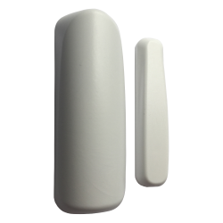
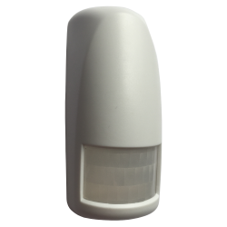
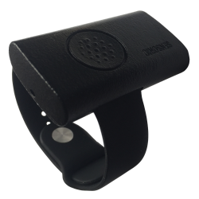

# Předávání událostí

Dokument popisuje způsob předávání událostí ze systému Netlia do aplikace partnera.

**Způsob komunikace je mezi Netlia a partnerem dohodnut a na straně Netlia nastaven.**

# Způsoby předávání dat

Data jsou předávána komunikačním protokolem ve formátu JSON a popisují události, které vznikají v systému NETLIA.
Položky datetime jsou v UTC podle ISO 8601. Pořadí parametrů není zaručeno a může se měnit.

## Předávání událostí přes HTTP callback

Partner může specifikovat URL endpointů na které jsou události zasílány formou HTTP(S) POST requestů. Requesty mají
kódování UTF-8 a Content-Type “application/json”. Systém se snaží předat události v režimu at-least-once, může tedy
nastat situace že je událost doručena víckrát. Tuto situaci lze ošetři s využitím položky `EventId`, která obsahuje
identifikátor události.

### URL HTTP requestu

Do URL je možné vložit zástupné parametry, které budou nahrazeny odpovídající hodnotou.

| Parametr        | Popis                         |
|:----------------|:------------------------------|
| ProtocolVersion | verze komunikačního protokolu |
| DeviceId        | identifikátor zařízení        |
| DeviceType      | typ zařízení                  |
| EventType       | typ události                  |

Příklad URL (doporučené nastavení):

`https://nejakaadresa.com/event/v{ProtocolVersion}/{DeviceId}/{EventType}/`

Pro uvedenou URL budou volány např. tyto requesty:

https://nejakaadresa.com/event/v1/abc123/event-start/

https://nejakaadresa.com/event/v1/abc123/measured-humidity/

### Hlavičky HTTP requestu
Partner může specifikovat další konfiguraci přidáním HTTP hlavičy (klíč a hodnota). Tím lze např. vyřešit autorizaci.

### Odpověď na HTTP request

Systém očekává v odpovědi HTTP status 200-299, kterým partner potvrdí přijetí události. Jiná odpověď je vyhodnocena jako nedoručení.

### Chování v případě nedoručení události
 V případě, že se nepodaří událost předat, systém pokus 10x opakuje s 5s prodlevami. Následně je událost zahozena.

# Komunikační protokol
Data jsou odesílána vždy jako samostatné události. Události mají společnou část parametrů.

Společné parametry:

| Parametr        | Typ     | Popis                          |
|:----------------|:--------|:-------------------------------|
| ProtocolVersion | integer | verze komunikačního protokolu  |
| DeviceId        | string  | identifikátor zařízení         |
| EventId         | string  | identifikátor události         |
| EventTime       | string  | čas události                   |
| DeviceType      | string  | typ zařízení                   |
| EventType       | string  | typ události                   |

Další případné parametry neuvedené v tabulce jsou závislé na typu zprávy a události.

# Zařízení a podporované události

## Vodní detektor
Detekuje přítomnost vody v ohraničeném prostoru.


Pokud v klidovém stavu dojde k zaplavení, je vyvolána událost `event-start`. Následně kontroluje každou minutu zda
zaplavení trvá a pokud trvá, tak po 10 minutách vyvolá událost `event-continue`. Pokud i nadále zaplavení pokračuje,
pošle po dalších 10 minutách událost `event-continue`, informující že zaplavení pokračuje, další již neposílá. Po skončení zaplavení
zařízení posílá `event-end`.

> DeviceType: water-detector

| EventType                                           | Popis                                                                   |
|:----------------------------------------------------|:------------------------------------------------------------------------|
| [restart](#eventtype-restart)                       | Restart zařízení.                                                       |
| [alive](#eventtype-alive)                           | Nastává v pravidelném intervalu, potvrzuje funkčnost zařízení.          |
| [transport](#eventtype-transport)                   | Přechod do transportního režimu - neaktivní stav s minimální spotřebou. |
| [event-start](#eventtype-event-start)               | Detekce vzniku zaplavení.                                               |
| [event-continue](#eventtype-event-continue)         | Zaplavení pokračuje.                                                    |
| [event-end](#eventtype-event-end)                   | Konec zaplavení.                                                        |

## Detektor pohybu
Detekuje pohyb předmětu, na kterém je zařízení připevněno nebo položeno. 


Pro případy, kdy chceme být informováni o tom, že se nějaký předmět pohnul. Například dveře, okno, kancelářský šuplík,
taška, auto, motocykl, kolo, kočárek, batoh, kufr …

Pokud v klidovém stavu dojde pohybu, je vyvolána událost `event-start`. Pokud v následujících 10 minutách znovu dojde k
pohybu tak počítá opakování pohybu a po 10 minutách pošle `event-continue`. `event-continue` se opakuje dokud dochází k
pohybu. Pokud je zařízení 10 minut od začátku nebo pokračování pohybu v klidu, posílá `event-end`.

> DeviceType: motion-detector

| EventType                                           | Popis                                                                      |
|:----------------------------------------------------|:---------------------------------------------------------------------------|
| [restart](#eventtype-restart)                       | Restart zařízení.                                                          |
| [alive](#eventtype-alive)                           | Nastává v pravidelném intervalu, potvrzuje funkčnost zařízení.             |
| [transport](#eventtype-transport)                   | Přechod do transportního režimu - neaktivní stav s minimální spotřebou.    |
| [tamper](#eventtype-tamper)                         | Otevření nebo zavření krytu zařízení, manipulace s bezpečnostním spínačem. |
| [event-start](#eventtype-event-start)               | Detekce začátku pohybu.                                                    |
| [event-continue](#eventtype-event-continue)         | Bohyb pokračuje.                                                           |
| [event-end](#eventtype-event-end)                   | Během 10 minut nedošlo k pohybu.                                           |

## Magnetický detektor
Rozpozná oddálení/přiblížení čidla od magnetu.



### Režim Simple

Pro identifikaci, že došlo k otevření/zavření skříní, oken, dveří nebo pro identifikaci vzdálení se nějakého předmětu od
jiného.

Vždy při oddálení magnetu je vyvolána událost `event-start`. Při přiblížení magnetu zpět vyvolá `event-end`.

> DeviceType: magnetic-detector-simple

| EventType                                           | Popis                                                                      |
|:----------------------------------------------------|:---------------------------------------------------------------------------|
| [restart](#eventtype-restart)                       | Restart zařízení.                                                          |
| [alive](#eventtype-alive)                           | Nastává v pravidelném intervalu, potvrzuje funkčnost zařízení.             |
| [transport](#eventtype-transport)                   | Přechod do transportního režimu - neaktivní stav s minimální spotřebou.    |
| [tamper](#eventtype-tamper)                         | Otevření nebo zavření krytu zařízení, manipulace s bezpečnostním spínačem. |
| [event-start](#eventtype-event-start)               | Magnet oddálen, začátek poplachu.                                          |
| [event-end](#eventtype-event-end)                   | Magnet přiblížen zpět, konec poplachu.                                     |

### Režim Continuous

Pro sledování četnosti otevření/zavření dveří, krytů, průchodu pohyblivých částí.

Pokud v klidovém stavu dojde k oddálení magnetu, je vyvolána událost `event-start`. Na přiblížení magnetu nijak
nereaguje, ale pokud dojde do 10 minut k opětovnému oddálení magnetu tak počítá kolikrát se oddálil a po 10 minutách
pošle `event-continue`. `event-continue` se opakuje dokud se něco děje. Pokud se během 10 minut nic nestane (nedojde k
oddálení magnetu), zařízení posílá `event-end`.

> DeviceType: magnetic-detector-continuous

| EventType                                           | Popis                                                                      |
|:----------------------------------------------------|:---------------------------------------------------------------------------|
| [restart](#eventtype-restart)                       | Restart zařízení.                                                          |
| [alive](#eventtype-alive)                           | Nastává v pravidelném intervalu, potvrzuje funkčnost zařízení.             |
| [transport](#eventtype-transport)                   | Přechod do transportního režimu - neaktivní stav s minimální spotřebou.    |
| [tamper](#eventtype-tamper)                         | Otevření nebo zavření krytu zařízení, manipulace s bezpečnostním spínačem. |
| [event-start](#eventtype-event-start)               | Magnet oddálen, začátek poplachu.                                          |
| [event-continue](#eventtype-event-continue)         | Dění na magnetu se opakuje, poplach pokračuje.                             |
| [event-end](#eventtype-event-end)                   | Během 10 minut nedošlo k oddálení magnetu, konec poplachu.                 |

## PIR detektor
Detekuje pohyb nebo přítomnost člověka ve vymezeném prostoru do vzdálenosti 10m. 



Pro identifikaci, že se v místnosti nebo ohraničeném prostoru pohybuje člověk, kdy a jak často.

Jakmile zařízení detekuje pohyb pošle zprávu s událostí `event-start`. Pokud i nadále detekuje pohyb, posílá v 10
minutových intervalech zprávy s událostí `event-continue`, že pohyb pokračuje, kolik pohybů zaznamenal a kdy nastal
poslední. Zařízení pošle zprávu s událostí `event-end`, že pohyb skončil pokud 10 minut nenastane žádný pohyb.

> DeviceType: pir-detector

| EventType                                           | Popis                                                                      |
|:----------------------------------------------------|:---------------------------------------------------------------------------|
| [restart](#eventtype-restart)                       | Restart zařízení.                                                          |
| [alive](#eventtype-alive)                           | Nastává v pravidelném intervalu, potvrzuje funkčnost zařízení.             |
| [transport](#eventtype-transport)                   | Přechod do transportního režimu - neaktivní stav s minimální spotřebou.    |
| [tamper](#eventtype-tamper)                         | Otevření nebo zavření krytu zařízení, manipulace s bezpečnostním spínačem. |
| [event-start](#eventtype-event-start)               | Detekce začátku pohybu.                                                    |
| [event-continue](#eventtype-event-continue)         | Pohyb pokračuje.                                                           |
| [event-end](#eventtype-event-end)                   | Během 10 minut nedošlo k pohybu.                                           |

## SOS tlačítko
Zařízení s tlačítkem pro přivolání pomoci nebo spuštění poplachu.




Zařízení po stitknutí tlačítka pošle zprávu s událostí `event-start`.

> DeviceType: sos-button

| EventType                             | Popis                                                                   |
|:--------------------------------------|:------------------------------------------------------------------------|
| [restart](#eventtype-restart)         | Restart zařízení.                                                       |
| [alive](#eventtype-alive)             | Nastává v pravidelném intervalu, potvrzuje funkčnost zařízení.          |
| [transport](#eventtype-transport)     | Přechod do transportního režimu - neaktivní stav s minimální spotřebou. |
| [event-start](#eventtype-event-start) | Stisknuto, začátek poplachu.                                            |

## Teploměr
Měří teplotu okolního prostředí.


Každou minutu měří teplotu. Po X měření provede výpočet průměrné hodnoty a odešle událost `measured-temperature`.

> DeviceType: thermometer

| EventType                                               | Popis                                                                   |
|:--------------------------------------------------------|:------------------------------------------------------------------------|
| [restart](#eventtype-restart)                           | Restart zařízení.                                                       |
| [alive](#eventtype-alive)                               | Nastává v pravidelném intervalu, potvrzuje funkčnost zařízení.          |
| [transport](#eventtype-transport)                       | Přechod do transportního režimu - neaktivní stav s minimální spotřebou. |
| [measured-temperature](#eventtype-measured-temperature) | Naměřené veličiny.                                                      |

### EventType measured-temperature

Nastává při odeslání naměřené hodnoty.

Dodatečné předávané parametry:

| Parametr    | Typ   | Povinný | Popis            |
|:------------|:------|:--------|:-----------------|
| Temperature | float | ano     | naměřená teplota |

Ukázka zaslané události:

```yaml
{
    "ProtocolVersion": 1,
    "DeviceId": "abc123",
    "DeviceType": "thermometer",
    "EventId": "c4056fc4-d433-4d2c-bb7f-23a691fd3dac",
    "EventTime": "2021-05-03T14:25:31.8437511Z",
    "EventType": "measured-temperature",
    "Temperature": 25.5
}
```

## Vlhkoměr/Teploměr
Měří teplotu a vlhkost okolního prostředí.


Každou minutu měří teplotu a vlhkost. Po X měření provede výpočet průměrné hodnoty a odešle událost `measured-humidity-temperature`.

> DeviceType: hygrometer-thermometer

| EventType                                                                 | Popis                                                                   |
|:--------------------------------------------------------------------------|:------------------------------------------------------------------------|
| [restart](#eventtype-restart)                                             | Restart zařízení.                                                       |
| [alive](#eventtype-alive)                                                 | Nastává v pravidelném intervalu, potvrzuje funkčnost zařízení.          |
| [transport](#eventtype-transport)                                         | Přechod do transportního režimu - neaktivní stav s minimální spotřebou. |
| [measured-humidity-temperature](#eventtype-measured-humidity-temperature) | Naměřené veličiny.                                                      |

### EventType measured-humidity-temperature

Nastává při odeslání naměřené hodnoty.

Dodatečné předávané parametry:

| Parametr    | Typ   | Povinný | Popis            |
|:------------|:------|:--------|:-----------------|
| Temperature | float | ano     | naměřená teplota |
| Humidity    | float | ano     | naměřená vlhkost |

Ukázka zaslané události:

```yaml
{
    "ProtocolVersion": 1,
    "DeviceId": "abc123",
    "DeviceType": "hygrometer-thermometer",
    "EventId": "c4056fc4-d433-4d2c-bb7f-23a691fd3dac",
    "EventTime": "2021-05-03T14:25:31.8437511Z",
    "EventType": "measured-humidity-temperature",
    "Temperature": 25.5,
    "Humidity": 27.5
}
```

# Společné události

Události na které je odkázáno z konkrétních typů zpráv.

## EventType restart
Nastává při restartu zařízení. K restartu může dojít stiskem restartovacího tlačítka umístěného na plošném spoji zařízení nebo restart může vyvolat firmware při hardwarové chybě nebo u některých změn konfigurace zařízení pomocí příkazu zaslaného prostřednictvím downlink API.

Ukázka zaslané události:
```yaml
{
    "ProtocolVersion": 1,
    "DeviceId": "abc123",
    "DeviceType": "magnetic-detector-simple",
    "EventId": "c4056fc4-d433-4d2c-bb7f-23a691fd3dac",
    "EventTime": "2021-05-03T14:25:31.8437511Z",
    "EventType": "restart"
}
```

## EventType alive
Nastává v pravidelném intervalu, potvrzuje funkčnost zařízení.

Ukázka zaslané události:
```yaml
{
    "ProtocolVersion": 1,
    "DeviceId": "abc123",
    "DeviceType": "magnetic-detector-simple",
    "EventId": "c4056fc4-d433-4d2c-bb7f-23a691fd3dac",
    "EventTime": "2021-05-03T14:25:31.8437511Z",
    "EventType": "alive"
}
```

## EventType transport

Nastává při přechodu zařízení do transportního režimu, ke kterému dojde po vložení nové baterie nebo pomocí příkazu
zaslaného prostřednictvím downlink API.

Zařízení v transportním režimu má velmi nízkou spotřebu a neposílá žádné zprávy. Pro probuzení zařízení z transportního režimu
je třeba stisknout RESET tlačítko umístěné na plošném spoji.

Ukázka zaslané události:
```yaml
{
    "ProtocolVersion": 1,
    "DeviceId": "abc123",
    "DeviceType": "magnetic-detector-simple",
    "EventId": "c4056fc4-d433-4d2c-bb7f-23a691fd3dac",
    "EventTime": "2021-05-03T14:25:31.8437511Z",
    "EventType": "transport"
}
```

[//]: # (## EventType downlink-acknowledge)

[//]: # (Informuje o doručení downlinkového commandu na zařízení.)

[//]: # ()

[//]: # (Ukázka zaslané události:)

[//]: # (```yaml)

[//]: # ({)

[//]: # (    "ProtocolVersion": 1,)

[//]: # (    "DeviceId": "abc123",)

[//]: # (    "DeviceType": "magnetic-detector-simple",)

[//]: # (    "EventId": "c4056fc4-d433-4d2c-bb7f-23a691fd3dac",)

[//]: # (    "EventTime": "2021-05-03T14:25:31.8437511Z",)

[//]: # (    "EventType": "downlink-acknowledge")

[//]: # (})

[//]: # (```)

## EventType tamper

Nastává při otevření nebo zavření krytu zařízení, manipulace s bezpečnostním spínačem.

Ukázka zaslané události:

```yaml
{
    "ProtocolVersion": 1,
    "DeviceId": "abc123",
    "DeviceType": "magnetic-detector-simple",
    "EventId": "c4056fc4-d433-4d2c-bb7f-23a691fd3dac",
    "EventTime": "2021-05-03T14:25:31.8437511Z",
    "EventType": "tamper"
}
```

## EventType event-start
Nastává při prvním vzniku události jako např. zaplavení kontaktů, oddálení magnetu, zaregistrování pohybu.

Ukázka zaslané události:
```yaml
{
    "ProtocolVersion": 1,
    "DeviceId": "abc123",
    "DeviceType": "magnetic-detector-simple",
    "EventId": "c4056fc4-d433-4d2c-bb7f-23a691fd3dac",
    "EventTime": "2021-05-03T14:25:31.8437511Z",
    "EventType": "event-start"
}
```

## EventType event-continue
Nastává pokud událost pokračuje.

Ukázka zaslané události:

```yaml
{
    "ProtocolVersion": 1,
    "DeviceId": "abc123",
    "DeviceType": "motion-detector",
    "EventId": "c4056fc4-d433-4d2c-bb7f-23a691fd3dac",
    "EventTime": "2021-05-03T14:25:31.8437511Z",
    "EventType": "event-continue",
    "EventCount": 0,
    "SecondsSinceLastEvent": 0
}
```

`EventCount` udává počet opakování události od posledního odeslání `event-start` nebo `event-continue`.

`SecondsSinceLastEvent` udává počet vteřin mezi poslední událostí a odesláním zprávy.

## EventType event-end
Nastává při skončení události. Situace kdy ukončení události nastane je popsána u každého zařízení, které tuto funkcionalitu podporuje.

Ukázka zaslané události:
```yaml
{
    "ProtocolVersion": 1,
    "DeviceId": "abc123",
    "DeviceType": "magnetic-detector-simple",
    "EventId": "c4056fc4-d433-4d2c-bb7f-23a691fd3dac",
    "EventTime": "2021-05-03T14:25:31.8437511Z",
    "EventType": "event-end"
}
```
