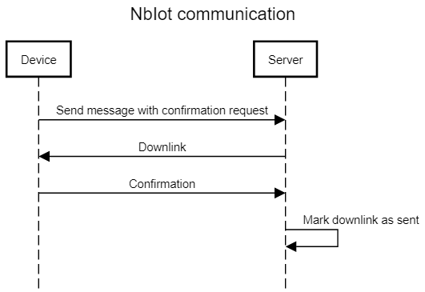
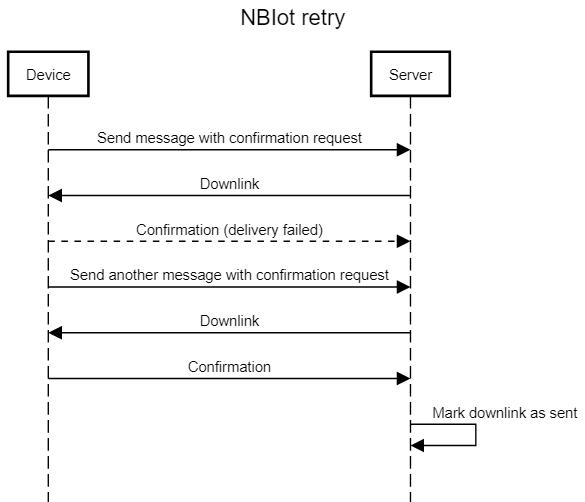
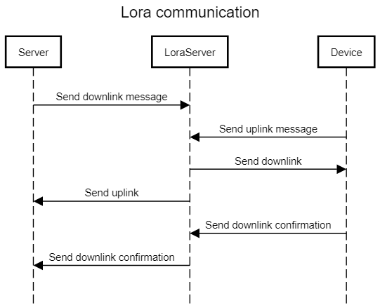
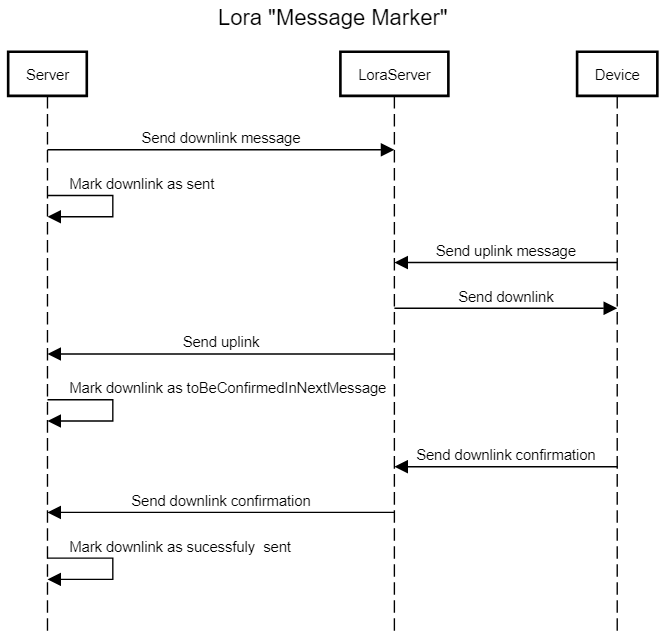
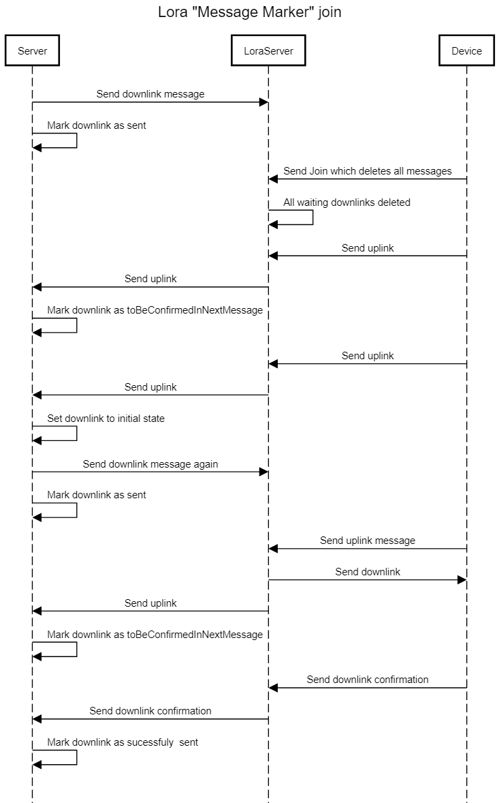
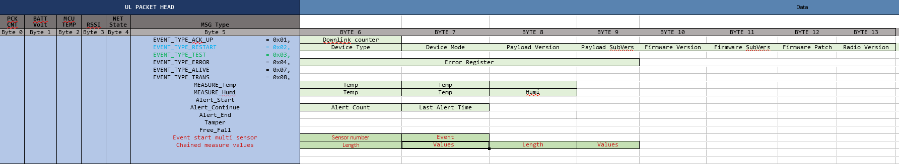

# Netlia dokumentace zařízení

Netlia nabízí velké množství zařízení které komunikují přes společný protokol. Tento dokument slouží k
popisu chování jednotlivých zařízení a k popisu společného komunikačního protokolu.

## Základní vlastnosti zařízení

 - Zařízení komunikují se serverem pomocí Lora (TODO odkaz) nebo NbIot (TODO odkaz) sítě. Výběr sítě záleží na typu zakoupeného zařízení.
 - Zařízení komunikují pomocí hexadecimálního payloadu. Příklad 020902050098434F0000020000.
 - Zařízení umožňují odesílat (TODO odkaz) i přijmat zprávy (TODO odkaz) ze serveru.
 - Zařízení obsahuje jeden až N senzorů které sledují okolí. Na základě informací z těchto senzorů se zařízení rozhoduje jakou zprávu bude odesílat na server. 

## Obecné chování zařízení

Zařízení odesílají tři hlavní druhy zpráv - event, restart a measure. Event zprávy jsou odeslány
vždy když zařízení zaznamená nějakou událost. Například když Move zařízení zaznamená pohyb
nebo když water detection zařízení přijde do kontaktu s vodou. Restart zprávy informují server že došlo k
restartování zařízení. Measure zprávy jsou odesílány v určitém
časovém intervalu a odesílají naměřená data. Příkladem může být naměřená teplota z teplotního senzoru.
Podrobný popis těchto a dalších zpráv můžete nájít zde (TODO odkaz).

Některé zprávy v závisloti na nastavení a typu zařízení vyžadují potvrzení ze serveru. V těchto
případech zařízení čeká na odpověď ze serveru a pokud ji neobdrží tak zprávu odešle znovu.
V době kdy se zařízení snaží opětovně odeslat zprávu nepřijmá žádné nové informace ze senzorů.
Pokud tedy nastane událost zatím co zařízení čeká na potvrzení ze serveru tak je tato událost ignorována.

Všechny zprávy které nejsou potvrzovány mouhou být ztraceny jelikož se je zařízení nesnaží odeslat znovu.
Server se o těchto zprávách nikdy nedozví. Jedinou informaci kterou může server získat je že se nějaká zpráva ztratila
jelikož neodpovídá počítadlo zpráv (TODO odkaz).

Stejně tak se může statát že některé zprávy dorazí na server víckrát než jednou. Server může duplicity detekovat
pomocí počítadla v hlavičce (TODO odkaz).

Zařízení dokáží přijmat zprávy ze serveru. Tyto zprávy můžeme rozdělit na potvrzení, nastavení konfigurace a příkazy.
Potvrzení slouží k potvrzování zpráv ze zařízení. Nastavení konfigurace umožňuje nastavit konfiguraci zařízení a
příkazy umožňují určitým způsobem manipulovat se zařízením. Například restartovat zařízení.
Více o těchto zprávách najdete zde (TODO odkaz).

## Restart zařízení

//TODO prepsat

Zařízení umožňuje dva druhy restartu - stisknutí tlačítka a vložení baterie. Při vložení baterie se zařízení
přepne do transportního režimu který šetří baterku a slouží převážně k přepravě zařízení. Pro přepnutí do běžného
režimu je potřeba stisknout restart tlačítko.

Při vložení baterie zařízení také restartuje některá nastavení která mohla být přenastavena ze serveru.
//TODO která?? Restart tlačítkem také může restartovat některá nastavení. //TODO která?? Více o
nastavení a restartu zařízení můžete najít zde (TODO odkaz pravdepodobne na downlink).

TODO popsat i to ze po restartu se posilaji test zpravy. Melo by to byt 1 min od restartu.

## Stavový diagram zařízení

Následující diagram popisuje stavy do kterých se zařízení může dostat. Většina zařízení ale nepodporuje všechny
stavy a poporuje pouze podmnožinu tohoto téměř úplného stavového automatu. Podrobnosti o jednotlivých
zařízeních najdete zde (TODO odkaz).

Stavový automat neobsahuje restart přechod. Restart zařízení může nastat v jakémkoliv stavu.

Stavový automat také nezohledňuje přijmání zpráv ze serveru.

## Dioda

Všechna zařízení mají notifikační diodu který informuje uživatele o různých událostech. Následující tabulka
popisuje

* Po restartu zařízení dioda jednou blikne aby jako potvrzení restartu.
* Při detekci nízkého napětí dioda blikne 5x.
* Při restartu připojení k síti dioda blikne 6x.

| Počet bliknutí | Událost                                                                                                  |
|----------------|----------------------------------------------------------------------------------------------------------|
| 1x             | Po restartu zařízení dioda jednou blikne aby jako potvrzení restartu.                                    |
| 1.byte         | Identifikátor přijatých zpráv                                                                            |
| 2.byte         | Stav baterie v zazení                                                                                    |
| 3.byte         | Teplota procesoru                                                                                        |
| 4.byte         | RSSI                                                                                                     |
| 5.byte         | 0 bit - Vyžádání potvrzení zprávy, 1 bit - disconect Zbylé bity - počet pokusů o odeslání zprávy |
| 6.byte         | Nepoužitý                                                                                                |
| 7.byte         | Typ zprávy                                                                                               |

## Zprávy ze zařízení na server

Zprávy se odesílají v hexadecimálním tvaru a skládají se ze dvou částí - hlavičky a dat.
Hlavička obsahuje obecné informace a typ zprávy. Typ zprávy pak určuje
jak bude vypadat datová část zprávy.

## Hlavičkla

Hlavička má 7 bytů a obsahuje obecné informace které jsou společné pro všechny typy zpráv.
Příklad: 0209020. Následující tabulka obsahuje zkrácený popis hlavičky. Celkový popis pro
jednotlivé byty následuje v dalších odstavcích.

| Pozice | Zkrácený popis                                                                                           |
|--------|----------------------------------------------------------------------------------------------------------|
| 0.byte | Identifikátor odslaných zpráv                                                                            |
| 1.byte | Identifikátor přijatých zpráv                                                                                |
| 2.byte | Stav baterie v zazení                                                                                    |
| 3.byte | Teplota procesoru                                                                                        |
| 4.byte | RSSI                                                                                     |
| 5.byte | 0 bit - Vyžádání potvrzení zprávy, 1 bit - disconect Zbylé bity - počet pokusů o odeslání zprávy |
| 6.byte | Nepoužitý                                                                                                |
| 7.byte | Typ zprávy                                                                                               |

### 0.byte - identifikátor odeslaných zpráv

Zařízení po každém odeslání nové zprávy zvýší počítadlo o 1.
Pokud počítadlo nabyde hodnoty 255 tak se při dalším odeslání zprávy nastaví na 0.

Počítadlo nezvyšuje svou hodnotu pokud se zařízení snaží znovu odeslat zprávu která
nebyla potvrzena.

Primární účel tohoto počítadla je zajištění idempotence na serveru.

Příklad:

| Číslo zprávy | Hodnota hlavičky                                                |
|--------------|-----------------------------------------------------------------|
| 1            | 00------------ (zbytek hlavičky je nahrazen - pro jednoduchost) |
| 2            | 01------------                                                  |
| 3            | 02------------                                                  |
| 255          | 254------------                                                 |
| 256          | 255------------                                                 |
| 257          | 00------------ (došlo k přetečení a counter se restartoval)     |

### 1.byte - identifikátor přijatých zpráv

Defautlně je nastaveno na 0. Po přijetí zprávy ze serveru se nastaví na hodnotu
přijatou v této zprávě. Více o této hodnotě zde (TODO odkaz).

### 2.byte - napětí baterie v zařízení

Určuje hodnotu napětí baterie. Pokud je zařízení napájeno ze zásuvky tak obsahuje hodnotu napětí zdroje.

Napětí může nabívat hodnot 1.8V–4.35V. Hodnota 0 odpovídá napětí 1.8V a hodnota 255 odpobvídá napětí 4.35V.

Aktuální napětí můžeme vypočítat podle následujícího vzorce: *naměřená hodnota* / 100 + 1.8

### 3.byte - teplota procesoru

Určuje teplotu procesoru. Tento byte může nabývat hodnotu 0-160 a 255. Aktuální
teplotu vypočítáme podle následujícího vzorce: "přijatá hodnota" - 40 = aktuální teplota.
Pokud je teplota vyšší než 120°C tak senzor pošle hodnotu 0xFF (255). Zařízení tedy
dokáže měřit teploty -40°C až 120°C.

Senzor nikdy nepošle hodnotu 161 až 254. Jelikož by odpovídala hodnotě vyšší než 120°C.

### 4.byte - RSSI

Určuje RSSI (TODO odkaz na wiki) zařízení při odesílání zprávy.

### 5.byte - potvrzení, disconnect a počet pokusů o odeslání zprávy

Tento byte obsahuje několik informací o právě odesílané zprávě. Obsah byte se liší podle toho jestli
zařízení používá síť NbIot nebo Lora.

#### Lora

Byte obsahuje tři informace. Následující tabulka vysvětluje složení bytu:

| Pozice  | Zkrácený popis                                     |
|---------|----------------------------------------------------|
| 0.bit   | Nepoužité                          |
| 1.bit   | Určuje zda zařízení bylo přepnuto do disconect módu |
| 2-7.bit | Počet pokusů o odeslání zprávy                     |

V Lora síti zařízení komunikuje s network serverem který až poté přeposílá zprávy na server.
Pokud se zařízení nepodaří odeslat zprávu na network server tak zvýší "Počet pokusů o odeslání zprávy"
a pokusí se zprávu po určitém čase odeslat znovu.

Po určitém počtu neúspěšných odeslání se zařízení přepne do disconnect módu který říká že zařízení čeká stále delší
dobu.

| Pokus o odeslání     | Hodnota 5.byte | Popis                                                                                                                                 |
|----------------------|----------------|---------------------------------------------------------------------------------------------------------------------------------------|
| 1. pokus o odeslání  | 0000000**1**   | Zařízení odeslalo zprávu a vyžaduje potvrzení.                                                                                        |
| 2. pokus o odeslání  | **000001**01   | Zařízení čekalo 4s na potvrzení z network serveru a nyní se snaží zprávu znovu odeslat. Počítadlo opakování (tučně) bylo zvýšeno o 1. |
| 3. pokus o odeslání  | 00001001       | Zařízení čekalo 4s na potvrzení z network server a nyní se snaží zprávu znovu odeslat.                                                |
| 4. pokus o odeslání  | 000011**1**1   | Zařízení čekalo 15 min a nyní se přeplo do disconnect módu (tučně) a pro další opakování bude čekat delší dobu.                       |
| 5. pokus o odeslání  | 00010011       | Zařízení čekalo 15 min                                                                                                                |
| 6. pokus o odeslání  | 00010111       | Zařízení čekalo 15 min                                                                                                                |
| 7. pokus o odeslání  | 00011011       | Zařízení čekalo 60 min                                                                                                                |
| 8. pokus o odeslání  | 00011111       | Zařízení čekalo 60 min                                                                                                                |
| 29. pokus o odeslání | 01110111       | Zařízení čekalo 60 min                                                                                                                |
| 30. pokus o odeslání | 01111011       | Zařízení čekalo do doby než mělo odeslat alive zprávu (TODO odkaz)  poté namísto alive zprávy znovu odeslalo tuto zprávu.         |
| 31. pokus o odeslání | 01111111       | Zařízení opět čeká do doby než se má odeslat alive zpráva                                                                             |

Před každým dalším odesláním zařízení čeká dokud není čas odeslat alive zprávu (TODO odkaz). Zařízení se snaží stejnou
zprávu odeslat stále dokola
dokud není restartováno (vybití baterie nebo ruční reset).

**Zařízení ignoruje požadavek na odeslání jakékoliv jiné zprávy dokud není
aktuální zpráva doručena.**

#### NbIot

Tento byte obsahuje tři informace. Následující tabulka vysvětluje složení bytu:

| Pozice  | Zkrácený popis                                      |
|---------|-----------------------------------------------------|
| 0.bit   | Žádost o potvrzení zprávy serverem                  |
| 1.bit   | Určuje zda zařízení bylo přepnuto do disconect módu |
| 2-7.bit | Počet pokusů o odeslání zprávy                      |

Pokud je 0.bit nastaven na 1 tak zařízení vyžaduje potvrzení zprávy.
Zařízení po odeslání čeká 3 sekundy a v tomto okně musí
ze serveru přijít potvrzení, konfigurační zpráva nebp příkaz. Více o posílání zpráv
na zařízení najdete zde (TODO odkaz).

Pokud potvrzení nedorazíb tak zařízení znovu  
odešle stejnou zprávu a zvýší *Počet pokusů o odeslání zprávy* o jedna.

Pokud ani podruhé nedorazí potvrzení tak se zařízení opět
pokusí zprávu odeslat.

Při dalším pokusu se zařízení přepne do disconnect módu (1.bit se nastaví na 1) a
zprávy odesílá se stále větším čekáním prodlevou.

Následující tabulka shrnuje předchozí informace a popisuje chování v disconnect módu:

| Pokus o odeslání     | Hodnota 5.byte | Popis                                                                                                                        |
|----------------------|----------------|------------------------------------------------------------------------------------------------------------------------------|
| 1. pokus o odeslání  | 0000000**1**   | Zařízení odeslalo zprávu a vyžaduje potvrzení (tučně označný bit).                                                           |
| 2. pokus o odeslání  | **000001**01   | Zařízení čekalo 3s a nyní se snaží zprávu znovu odeslat. Počítadlo opakování (tučně) bylo zvýšeno o 1.                       |
| 3. pokus o odeslání  | 00001001       | Zařízení čekalo 3s a nyní se snaží zprávu znovu odeslat.                                                             |
| 4. pokus o odeslání  | 000011**1**1   | Zařízení čekalo 15 min a nyní se přeplo do disconnect módu (tučně) a pro další opakování bude čekat delší dobu.              |
| 5. pokus o odeslání  | 00010011       | Zařízení čekalo 15 min                                                                                                       |
| 6. pokus o odeslání  | 00010111       | Zařízení čekalo 15 min                                                                                                       |
| 7. pokus o odeslání  | 00011011       | Zařízení čekalo 60 min                                                                                                       |
| 8. pokus o odeslání  | 00011111       | Zařízení čekalo 60 min                                                                                                       |
| 29. pokus o odeslání | 01110111       | Zařízení čekalo 60 min                                                                                                       |
| 30. pokus o odeslání | 01111011       | Zařízení čekalo do doby než mělo odeslat alive zprávu (TODO odkaz)  poté namísto alive zprávy znovu odeslalo tuto zprávu |
| 31. pokus o odeslání | 01111111       | Zařízení opět čeká do doby než se má odeslat alive zpráva                                                                    |

Před každým dalším odesláním zařízení čeká dokud není čas odeslat alive zprávu (TODO odkaz). Zařízení se snaží stejnou
zprávu odeslat stále dokola
dokud není restartováno (vybití baterie nebo ruční reset).

**Zařízení ignoruje požadavek na odeslání jakékoliv jiné zprávy dokud není
aktuální zpráva doručena.**

### 6.byte - nepoužitý

### 7.byte - typ zprávy

Typ zprávy určuje co budou obsahovavt další byte ve zprávě. Následující tabulka ukazuje jaké hodnoty může
tento byte nabívat:

| Hodnota | Název               |
|---------|---------------------|
| 1       | DownlinkaAcknowlege |
| 2       | Restart             |
| 3       | Test                |
| 4       | Error               |
| 5       | Event               |
| 7       | Alive               |
| 8       | Transport           |
| 9       | Measure             |

DownlinkaAcknowlege, Restart, Test, Error, Alive, Transport a Event mají stejný obsah pro všechna zařízení.
Tyto zprávy jsou popsány v dalších odstavcích o datech.

Measure zpráva informuje o naměřené hodnotě (např. teplota u teploměru).
Measure se liší podle typu zařízení a je popsána dále v tomto dokumentu u popisu jednotlivých
zařízení. (TODO odkaz)

## Data

Následující odstavce popisují datovou část zprávy. Všechny tyto zprávy začínají společnou
hlavičkou která je popsaná výše (TODO odkaz).

### Downlink acknowlage

Downlink acknowlage se odesílá vždy po přijetí příkazu ze serveru jako potvrzení.
V hlavičce je označen hodnotou 1 v 7.bytu (Typ zprávy).

Obsah:

| Byte   | Význam                       |
|--------|------------------------------|
| 0.byte | Nepoužitý vždy obsahuje 0xFF |
| 1.byte | Nepoužitý vždy obsahuje 0x00 |

### Restart

Posílá se vždy po restartu zařízení tlačítkem nebo při přijetí reset zprávy (TODO nazev a odkaz)
ze serveru.
V hlavičce je označen hodnotou 0x02 v 7.bytu (Typ zprávy).

Obsah:

| Byte    | Význam                       |
|---------|------------------------------|
| 0.byte  | Nepoužitý vždy obsahuje 0xFF |
| 1.byte  | Nepoužitý vždy obsahuje 0x12 |
| 2.byte  | Typ zařízení                 |
| 3.byte  | Mód zařízení                 |
| 4.byte  | major verze payloadu         |
| 5.byte  | minor verze payloadu         |
| 6.byte  | major verze firmwaru         |
| 7.byte  | minor verze firmwaru         |
| 8.byte  | patch verze firmwaru         |
| 9.byte  | major verze radia            |
| 10.byte | minor verze radia            |
| 11.byte | patch verze radia            |
| 12.byte | počet restartů               |
| 13.byte | kód restartu                 |

Typ a mód zařízení identifikuje zařízení a jeho interní nastavení. Detaily o typu
a módu jsou popsány u jednotlivých zařízení TODO odkaz.

Major, minor a patch verze vždy udává verzi podle definice [semantického verzovani](https://semver.org/).
Tyto údaje slouží převážně k diagnostice zařízení.

Počet restartů udává kolikrát bylo zařízní restartováno od nastavení zařízení do továrního režimu.

Kód restartu udává důvod proč resatart nastal. Byte může nabívat následujících hodnot:

| Hodnota | Význam                                      |
|---------|---------------------------------------------|
| 0       | Restart způsoben chybou Freez_RST           | //TODO co je freez rst? 
| 1       | Restart vyvolán přijmutím zprávy ze serveru | //TODO odkaz
| 2       | Restart způsoben stisknutím tlačítka        |
| 3       | Restart způsoben chybou HARDFAULT           | // TODO co to je??
| 4-7     | Nepoužito                                   |

### Test

Zařízení po odeslání restart zprávy odesílá test zprávu. Test zprávy jsou potvrzovány ze serveru
a tak umožňují serveru odeslat konfigurace na zařízení ještě před tím než začne fungovat standartním způsobem.

U NbIot je možné tyto konfigurace odeslat i v odpovědi na restart zprávu. U zařízení používající Lora
síť to není možné kvůli fungování Lora sítě. Více o loře najdete zde.

Zařízení podporují odeslat nula až 255 testovacích zpráv.
Defaultní nastavení pro většinu zařízení je jedna testovací zpráva.
Jak nastavit počet testovacích zpráv můžete najít zde (TODO odkaz).

Zařízení vždy čeká 1 minutu po odeslání restart zprávy a až poté odešle test zprávu.
Mezi každými dvěma test zprávamy je také prodleva 1 minuta.

Obsah:

| Byte   | Význam                       |
|--------|------------------------------|
| 0.byte | Nepoužitý vždy obsahuje 0xFF |
| 1.byte | Nepoužitý vždy obsahuje 0x00 |

### Error

Error zpráva je ze zařízení odeslána když nastane hardwarová chyba.

Obsah:

| Byte            | Význam                               |
|-----------------|--------------------------------------|
| 0.byte          | Typ chyby                            |
| 1.byte          | Nepoužitý vždy obsahuje 0x04         |
| 2.byte - 5.byte | Obsahuje hodnotu z chybového registru | 

Errory se dělí na dva druhy chyb - fatální a normální. Normální chyby mají hodnotu 0.bytu 
nastavenou na 0 a fatální mají hodnotu 1.

Pokud v zařízení nastane fatální chyba tak se zařízení restartuje. Poté pošle restart zprávu
a následně odešle errorovou zprávu. 
// TODO ma prednost errorova zprava nebo test zprava?
// TODO po jak dlouhe dobe je Errorová zpráva je odeslná?

Pokud nastane normální chyba tak zařízení pošle errorovou zprávu a nerestartuje se. Pokud 
se chyba opakuje tak je odeslána další errorová zpráva. Pokud je normální errorová
zpráva detekována a odeslána 5* tak se vyvolá fatální chyba. Zařízení se pak restartuje
a odešle errorovou zprávu stejně jako u každé jiné fatální chyby.

// TODO co kdyz se seenzor snaží odeslat zprávu a nemá připojení a v tu chvíli nastane HW chyba

Chybový registr obsahuje informaci o tom jaká chyba nastala. Následující tabulka popisuje
hodnoty a jejich význam:

| Hodnota v binární podobě            | Význam                                     | Závažnost chyby |
|-------------------------------------|--------------------------------------------|-----------------|
| 00000000 00000000 00000000 00000000 | Chyba CLEAR_TRY - I2C                      | Normální        |
| 00000000 00000000 00000000 00000001 | Chyba CLEAR_TRY - UART                     | Normální        |
| 00000000 00000000 00000000 00000010 | Chyba CLEAR_TRY - EEPROM                   | Normální        |
| 00000000 00000000 00000000 00000100 | Chyba CLEAR_TRY - senzor                   | Normální        |
| 00000000 00000000 00000000 00001000 | Chyba CLEAR_TRY - akční člen               | Normální        |
| 00000000 00000000 00000001 00000000 | Chyba Freeze_RST - radio                   | Fatální         |
| 00000000 00000000 00000010 00000000 | Chyba Freeze_RST - vložení ne plné baterie | Fatální                |
| 00000000 00000000 00000100 00000000 | Chyba Freeze_RST - neočekávaný stav STM    | Fatální                |
| 00000000 00000000 00001000 00000000 | Chyba Freeze_RST - chyba stavu STM_INIT    | Fatální                |
| 00000000 00000000 00010000 00000000 | Normální chyba nastala 5*                  | Fatální                |
| 00000000 00000001 00000000 00000000 | Chyba Change_State - spojení (Sítě)        | Fatální                |
| 00000000 00000010 00000000 00000000 | Chyba Change_State - nízké napětí baterie  | Fatální                |
| 00000000 00000100 00000000 00000000 | Chyba Change_State - event bufferu         | Fatální                |
// TODO lepsi vyznam Tohle je pouze vykopírováno z dokumentace. Dokumentace také vysvetluje Change_State atd.

### Alive

Alive zpráva slouží jako notifikace že zařízení je v pořádku a stále vysílá. Alive zpráva
se posílá pouze pokud zařízení dlouhou dobu nekomunikovalo. Defaultně je alive zpráva odeslána pokud
zařízení neodeslalo žádnou zprávu 12 hodin. Interval se dá nastavit pomocí příkazu ze serveru (TODO nazev a odkaz).

Obsah:

| Byte   | Význam                       |
|--------|------------------------------|
| 0.byte | Nepoužitý vždy obsahuje 0xFF |
| 1.byte | Nepoužitý vždy obsahuje 0x00 |

### Event

Zpráva událost informuje že zařízení zaznamenalo nějakou důležitou
událost. Na jaké události zařízení reaguje se liší podle typu zařízení.
Například zařízení které detekuje pohyb odešle zprávu typu event při
detekci pohybu.

Některá zařízení dokáží také detekovat otevření krytu a nebo volný pád
zařízení. Následující odstavce popisují zprávu událost obecným způsobem.
V následující části dokumentace (TODO odkaz) jsou pak popsány jednotlivé
jak přesně se chovají jednotlivá zařízení.

Nultý byte ve zprávě určuje typ události která nastala.

| Byte   | Význam                                                                                     |
|--------|--------------------------------------------------------------------------------------------|
| 0.byte | Typ události - start, continue, end, tamper start, tamper end a free fall |

Hodnoty nultého byte mohou být následující:

| Hodnota | Událost      |
|---------|--------------|
| 0       | start        |
| 1       | continue     |
| 2       | end          |
| 3       | tamper start |
| 4       | tamper end   |
| 5       | free fall    |

#### Event start, continue a end

Pokud hlavní senzor na zařízení zaznamená událost tak odešle zprávu událost začala.
Poté každých 10 minut odesílá zprávu událost pokračuje
až do doby než 10 minut nedetekuje žádnou událost. Poté co 10 minut
nedetekuje událost tak odešle událost konec.

Co přesně je událost se liší podle zařízení. Může to být zaznamenání pohybu,
zaznamenání vody nebo třeba zaznamenání pohybu. Kdy je událost odeslána
pro jednotlivá zařízení je popsáno v sekci (TODO odkaz).

Některá zařízení neodesílají všechny druhy událostí nebo se chovají trochu
odlišně. Je tedy důležité přečíst jak fungují jednotlivá zařízení v sekci
(TODO Odkaz).

Události start, end a continue mají následující formát:

| Byte   | Význam                               |
|--------|--------------------------------------|
| 1.byte | Nepoužitý vždy obsahuje 0x03         |
| 2.byte | Počet událostí                       |
| 3.byte | Čas od poslední události v sekundách |

Počet událostí určuje kolik událostí nastalo od odeslání předchozí události.
Pro událost end je tato hodnota vždy 0 a pro událost start je tato hodnota
vždy 1.

Čas od poslední události určuje čas od doby kdy senzor naposledy
zaznamenal událost. Pro
událost start je tato hodnota vždy 0. Jelikož se tato událost odesílá
hned po zaznamenání události senzorem. Pro událost continue je tato
hodnota vždy 0-10 minut jelikož zařízení odesílá událost continue
každých 10 minut a senzor mohl událost zaznamenan kdykoliv v této době.  
Pro událost end je tato hodnota vždy větší než 10 minut.

#### Tamper

Tato událost říká že došlo k otevření nebo k zavření krytu zařízení.
Formát události

| Byte   | Význam                       |
|--------|------------------------------|
| 1.byte | Nepoužitý vždy obsahuje 0x03 |
| 2.byte | 0 - nepoužité                |
| 3.byte | 0 - nepoužité                |

### Transport

Transport zpráva je odeslána při přepnutí zařízení do transportního režimu. Transportní režim je
speciální stav zařízení ve kterém zařízení nekomunikuje a šetří baterii. Obvykle se používá pro
přepravu nebo skladování zařízení.

Zařízení se do transportního režimu dostane vložením baterie. Ukončen transportního režimu nastane
při stisknutí restart tlačítka.

## Zařízení

V následujících odstavcích jsou popsána jednotlivá zařízení a jejich chování.

### Water detection

Zařízení slouží k detekci vody. Událost start se odešle když je zařízení
zaplaveno vodou. Pokud je zařízení v dalších 10 minutách detekuje vodu
tak je odslána událost continue. Událost end je poté odeslána pokud
10 minut není detekována voda.

* Zařízení podporuje pouze události - start, continue, end, alive, transport a restart.

Vodní zařízení má narozdíl od ostatních zařízení nastavený maximální počet zpráv typu continue.
Zařízení vždy pošle pouze 2 zprávy continue a poté už čeká na ukončení události a neposílá další pokračovací zprávy.

### Move detection

Zařízení slouží k detekci pohybu. Událost start je odeslána když zařízení detekuje
pohyb. Událost continue je odeslána pokud je zaznamenán další pohyb v příštích 10 minutách.
Událost end je poté odeslána pokud zařízení 10 minut nezaznamená ani jeden pohyb.

* Zařízení podporuje pouze události - tamper, start, continue, end, alive, transport a restart.

### Magnetic

Zařízení slouží ke sledování četnosti otevření/zavření dveří, krytů, průchodu pohyblivých částí.
Zařízení podporuje dva režimy. Režim continuous a simple. Mezi těmito
režimy lze přepínat pomocí zprávy ze serveru (TODO odkaz). Defaultní mód je simple.

* Zařízení podporuje pouze události - tamper, start, continue, end, alive, transport a restart.

#### Režim continuous

Pokud v klidovém stavu dojde k oddálení magnetů, je vyvolána událost start.
Na přiblížení magnetu nijak nereaguje, ale počítá každé oddálení magnetů
a po 10 minutách pošle událost continue.
Pokud se během 10 minut nic nestane (nedojde k oddálení magnetu),
zařízení posílá událost end.

#### Režim simple

Každé oddálení magnetů odešle událost start. Pokud zařízení po odeslání události start 10 minut
nedetekuje oddálení magnetů tak odešle událost end.

### Pir

Detekuje pohyb nebo přítomnost člověka ve vymezeném prostoru do vzdálenosti 10m.

Jakmile senzor detekuje pohyb pošle zprávu s událostí start.
Pokud i nadále detekuje pohyb, posílá v 10 minutových intervalech zprávy s
událostí continue. Senzor pošle zprávu s událostí end
pokud 10 minut nenastane žádný pohyb.

* Zařízení podporuje pouze události - tamper, start, continue, end, alive, transport a restart.

### Alert button

Zařízení s tlačítkem pro přivolání pomoci nebo spuštění poplachu.
Zařízení posílá událost start pokud někdo zmáčnkne na tlačítko.
Událost end nikdy není odeslána.

* Zařízení podporuje pouze události - start, alive, transport a restart.

### Thermometer

Každou minutu měří teplotu. Po X měření provede výpočet průměrné hodnoty
a odešle událost measured nas server.

* Zařízení podporuje pouze události - measure, alive, transport a restart.
* Zařízení odesílá zprávu typu measure která obsahuje naměřené teploty

Measure zpráva má následující formát:

| Byte             | Význam                         |
|------------------|--------------------------------|
| 0.byte           | Nepoužité - vždy obsahuje 0xFF |
| 1.byte           | Nepoužité - vždy obsahuje 20   |
| 2.byte - 21.byte | Naměřené teploty               |

2.byte - 21.byte obsahuje posledních 9 hodnot odeslaných na server a jednu
novou hodnotu. Historické hodnoty jsou ve zprávě obsažené protože se může některá ze
zpráv ztratit a server pak může vypadlou hodnotu zjistit zpětně.

Každá naměřená hodnota ve zprávě zabírá 2 byte.

Zprávy jsou seřazené od nejaktuálnějšího měření až po nejstarší.

Zařízení umožňuje nastavit jak často se má measure zpráva odeslat a také
kolik vzorků se má za daný interval naměřit.
Defaultní nastavení je 10 minu a 10 zpráv. Zařízení tedy každou minutu změří
teplotu a po 10 minutách odešle průměr naměřených teplot společně s 9 předcházejícími
odeslanými teplotami. Zařízení tedy pošle každých deset minut teploty za posledních
100 minut. Jak často se mají zprávy odeslat a kolikrát se má v tomto intervalu
teplota měřit je možné nastavit pomocí zprávy ze serveru. Více zde. TODO odkaz

// TODO v jakem formatu jsou teploty odeslinay? Je to zase nejaky offset aby byly mereny
// zaporne?

### Humidity meter

Každou minutu měří teplotu a vlhkost. Po X měření provede výpočet průměrné hodnoty a odešle
událost measured na server.

* Zařízení podporuje pouze události - measure, alive, transport a restart.
* Zařízení odesílá zprávu typu measure která obsahuje naměřenou teplotu a vlhkost

Measure zpráva má následující formát:

| Byte             | Význam                         |
|------------------|--------------------------------|
| 0.byte           | Nepoužité - vždy obsahuje 0xFF |
| 1.byte           | Nepoužité - vždy obsahuje 30   |
| 2.byte - 31.byte | Naměřené teploty a vlhkosti    |

Zařízení funguje stejně jako temperature meter popsaný zde. Jediný
rozdíl je že posílá teplotu a vlhkost. Každá naměřená hodnota má délku
3 byte kde první dva byte určují teplotu a třetí byte určuje vlhkost.

Vlhkost je určována v % a může nabívat hodnoty 0-100.

## Přijmání zpráv ze serveru

Zařízení dokáží přijmat zprávy ze serveru. Tyto zprávy můžeme rozdělit na potvrzení, nastavení konfigurace a příkazy.
Potvrzení slouží k potvrzování zpráv ze zařízení. Nastavení konfigurace umožňuje nastavit konfiguraci zařízení a
příkazy umožňují určitým způsobem manipulovat se zařízením - například vynutit restart.

Všechny zprávy jsou idempotetní. Server tedy může stejnou zprávu odeslat vícekrát a výsledek bude stále stejný.
Idempotence je zajištěna podstatou zpráv a né pomoci Id zprávy. Zařízení tedy zprávu zpracuje víckrát
ale všechny příkazy a nastavení jsou vytvořené tak aby to nebyl problém.

Pokud zařízení úspěšně přijme konfigurační nebo příkazovou zprávu tak
odešle zpět na server potvrzení o přijetí. Potvrzovací zprávy odeslané ze serveru
nejsou potvrzovány zařízením. Formát potvrzovací zprávy které odesílá zařízení je popsán zde (TODO odkaz).

Zařízení vždy nejdříve odešle potvrzení a až poté příkaz zpracuje. Pokud
tedy zařízení přijme příkaz na restartování tak nejdříve odešle potvrzení
a až poté se restartuje.

## Lora a NbIot

Zařízení komunikují pomocí Lora nebo NBIot sítě. Odesílání zpráv na zařízení se liší podle toho kterou síť zařízení
využívá. Síť je vybrána už při výrobě zařízení a není možné ji změnit.

### NbIot

Pokaždé když zařízení odesílá zprávu vyžadující potvrzení (TODO odkaz) tak má server možnost odeslat
zprávu na zařízení. Zařízení na zprávu ze serveru čeká 5 sekund. Server musí odpovědět
příkazem, nastavením konfigurace nebo pouze potvrzením pokud nechce na zařízení nic měnit.
Pokud zařízení nepřijme v čase 5 sekund žádnou zprávu tak znovu odesílá původní
zprávu více zde (TODO odkaz).

Pokud server odešle více zpráv naráz tak zařízení zpracuje pouze první zprávu
a další ignoruje.

Pro jednoduchost implementace na serveru je možné potvrzovat všechny přijaté
zprávy. Pokud zařízení nevyžaduje potvrzení ale server ho pošle tak je
potvrzení ignorováno.

Následující diagramy ukazují odeslání příkazové nebo konfigurační
zprávy na zařízení.
Uplink je jakákoliv zpráva odesílaná ze zařízení na server.
Downlink je jakákoliv zpráva posílaná ze serveru na zařízení.

Situace kdy se ztratí potvrzující zpráva:

### Lora

V Lora síti zařízení komunikuje s network serverem který se stará o odesílání zpráv
na server a na zařízení. Funguje tedy jako prostředník mezi serverem a zařézením.

Pokud chce server odeslat zprávu na zařízení musí ji odeslat na network server.
Network server si zprávu uloží a poté čeká dokud zařízení neposílá zprávu. Poté
přijme zprávu ze zařízení a tu odešle na server. Ve stejnou dobu kdy odesílá zprávu
na server odešle i zprávu na zařízení.

Následující diagramy ukazují odeslání příkazové nebo konfigurační
zprávy na zařízení.
Uplink je jakákoliv zpráva odesílaná ze zařízení na server.
Downlink je jakákoliv zpráva posílaná ze serveru na zařízení.

Network sever vždy musí čekat až zařízení zahájí komunikaci. Může se tedy
stát že zpráva ze serveru je doručena až po dlouhé době.

Pokud zařízení úspěšně přijme zprávu tak odešle na server
potvrzení. Formát potvrzovací zprávy je popsané zde (TODO odkaz).

Pro lora síť nemá význam odesílat na zařízení potvrzovací zprávu i když si ji zařízení vyžádá (TODO odkaz)
jelikož o potvrzení se stará Lora síť automaticky u všech zpráv.

V některých situacích musí zařízení provést nové navázání komunikace s network serverem.
Nové navázání spojení způsobí že zprávy které jsou uložené na network serveru
jsou smazány a server je musí odelat na network server znovu.
Nové navázání komunikace se děje vždy když je zařízení restartováno, když je restartován modem rádia (TODO odkaz) a
v některých případech kdy se opakovaně nepodaří doručit zprávu.

Na lora network server je možné odeslat více zpráv zároveň.
Tato funkcionalita obvykle není potřeba ale je možné ji naimplementovat
a využít identifikátor zprávy (TODO odkaz) pro identifikaci toho kterou zprávu
zařízení potvrzuje.

#### Implementace odesílání zpráv na zařízení v lora síti

Implementaci odesílání zpráv na zařízení v lora síti můžeme provést
několika způsoby. Nejjednoduším způsobem je "označování zpráv". V této
implementaci server odešle downlink a označího jako
"odelaný". Poté co přijme první uplink od odeslání downlinku tak
stav odeslaného downlinku změní na "bude potvrzen v příští zprávě".
V další zprávě by měl přijít uplink s potvrzením. Pokud dorazí
tak je downlinková zpráva úspěšně odeslána.

Následující diagram ukazuje chování v případě že zařízení
provede join (nové navázání komunikace s network serverem) a smaže zprávu který čeká na network serveru:

Nevýhodou tohoto řešení je že při navázání nového spojení s network serverem
může doručení zprávy trvat dlouhou dobu. Doručení zprávy se ale dá
urychlit tak že když na server přijde reset zpráva tak okamžitě znovu odešleme
aktuální zprávu čekající na potvrzení bez čekání na další zprávu. Toto urychlení
můžeme provést protože víme že restart vždy způsobí smazání zpráv na network serveru.

## Struktura zpráv

Zprávy se dělí na hlavičku a data. Hlavička je společná pro všechny zprávy a datová část se liší
podle hodnoty 4. a 5. byte.

### Hlavička

#### 0.byte

Identifikátor zprávy. Hodnota kterou server odešle v tomto byte je zkopírována
a vrácena v hodnotě (TODO odkaz). Tato hodnota může sloužit jako identifikátor zpráv
které byly přijaty zařízením.

Pokud server nikdy neodesílá více než jednu zprávu naráz tak tento identifikátor
není potřeba.

#### 1.byte

Nepoužitý.

#### 2.byte

Nepoužitý.

#### 3.byte

Nepoužitý.

#### 4.byte a 5.byte - typ dat

Následující tabulka popisje jakých hodnot může nabývat 4. a 5. byte. Tyto byte určují jak bude vypadat
datová část zprávy. Datová část je popsána v další části.

| Hodnota 4.Byte | Hodnota 5.byte | Význam                                                      |
|----------------|----------------|-------------------------------------------------------------|
| 0x01           | 0x01           | Potvrzení zprávy                                            |
| 0x02           | 0x02           | Restart zařízení                                            |
| 0x02           | 0x03           | Přepnutí zařízení do transportního režimu                   |
| 0x02           | 0x04           | Restart rádia                                               |
| 0x04           | 0x01           | Kolikátá zpráva vyžaduje potvrzení                          |
| 0x04           | 0x02           | Vypnutí potvrzování zpráv                                   |
| 0x04           | 0x03           | Vypnutí potvrzování události start                          |
| 0x04           | 0x04           | Interval alive zpráv                                        |
| 0x04           | 0x05           | Jak často se má odeslat measure zpráva                      |
| 0x04           | 0x06           | Nastavení ledek, buzzeru a motoru když nastane událost      |
| 0x04           | 0x08           | Zapnutí nebo vypnutí Lora ADR                               |
| 0x04           | 0x09           | Nastaví Lora dataRate                                       |
| 0x04           | 0x0A           | Nastaví módu zařízení pro magnet                            |
| 0x04           | 0x0B           | Omezení maximálního počtu zpráv typu událost pokračuje      |
| 0x04           | 0x0C           | Určuje periodu vzorkování pro teplotní a vlhkostní zařízení |
| 0x04           | 0x0E           | Nastavení citlivosti pohybového zařízení                    |
| 0xFF           | prázdný        | Restartuje všechna nastavení na defaultní                   |

### Data

Následující odstavce podrobně popisují co jednotlivé zprávy znamenají.

#### Potvrzení zprávy

Zpráva slouží k potvrzení zprávy která přišla ze zařízení. Potvrzení zprávy
je potřeba odeslat pouze pokud zařízení používá síť NbIot a vyžádá si ho v hlavičce odeslané zprávy (TODO odkaz).

Defaultně je nutné potvrdit následující zprávy: Event start, Alive, Reset a každá šestá zpráva od posledního potvrzení.

Struktura:

| Byte    | Význam                         |
|---------|--------------------------------|
| 0.byte  | Nepoužité - vždy obsahuje 0x00 |

#### Restart zařízení

Zařízení se restartuje.

Struktura:

| Byte    | Význam                         |
|---------|--------------------------------|
| 0.byte  | Nepoužité - vždy obsahuje 0x00 |

#### Přepnutí zařízení do transportního režimu

Zařízení se přepne do transportního režimu (TODO odkaz)

Struktura:

| Byte    | Význam                         |
|---------|--------------------------------|
| 0.byte  | Nepoužité - vždy obsahuje 0x00 |

#### Restart rádia

Restartuje rádio v zařízení.

Struktura:

| Byte    | Význam                         |
|---------|--------------------------------|
| 0.byte  | Nepoužité - vždy obsahuje 0x00 |

#### Kolikátá zpráva vyžaduje potvrzení

Určí kolikátá zpráva musí vždy být potvrzena. Defaultní hodnota je TODO ??.
Více o potvrzování (TODO odkaz)

Struktura:

| Byte   | Význam                                                             |
|--------|--------------------------------------------------------------------|
| 0.byte | Nepoužité - vždy obsahuje 0x01                                     |
| 1.byte | Určuje maximální počet pokračování poplachů které se budou posílat |

#### Vypnutí a zapnutí potvrzování zpráv

Odeslání této zprávy na zařízení vypne nebo zapne vyžadování potvrzení zpráv zařízením.

Struktura:

| Byte   | Význam                                               |
|--------|------------------------------------------------------|
| 0.byte | Nepoužité - vždy obsahuje 0x01                       |
| 1.byte | 0 vypne potvrzování zpráv, 1 - zapne potvrzoví zpráv |

#### Vypnutí potvrzování události start

Vypne nebo zapne potvrzování události start.

Struktura:

| Byte   | Význam                                               |
|--------|------------------------------------------------------|
| 0.byte | Nepoužité - vždy obsahuje 0x01                       |
| 1.byte | 0 vypne potvrzování zpráv, 1 - zapne potvrzoví zpráv |

#### Interval alive zpráv

Nastaví za jak dlouhou dobu se má odeslat alive zpráva od poslední komunikace.
Defaultní hodnota je 12 hodin od poslední odeslané zprávy.

| Byte   | Význam                         |
|--------|--------------------------------|
| 0.byte | Nepoužité - vždy obsahuje 0x03 |
| 1.byte | Hodiny                         |
| 2.byte | Minuty                         |
| 3.byte | Sekundy                        |

#### Jak často se má odeslat measure zpráva

Nastaví jak casto se má odesílat measure zpráva.

| Byte   | Význam                         |
|--------|--------------------------------|
| 0.byte | Nepoužité - vždy obsahuje 0x03 |
| 1.byte | Hodiny                         |
| 2.byte | Minuty                         |
| 3.byte | Sekundy                        |

#### Nastavení ledek, buzzeru a motoru když nastane událost

| Byte   | Význam                         |
|--------|--------------------------------|
| 0.byte | Nepoužité - vždy obsahuje 0x01 |
| 1.byte | Obsahuje nastavení             |

Složení 1.byte:

| Bit           | Význam    |
|---------------|-----------|
| 0.bit         | Led 1     |
| 1.bit         | Led 2     |
| 2.bit         | Buzzer    |
| 3.bit         | Motor     |
| 4.bit - 7.bit | Nepoužité |

#### Zapnutí nebo vypnutí Lora ADR

Vypne nebo zapne [Lora ADR](https://lora-developers.semtech.com/documentation/tech-papers-and-guides/understanding-adr/)
.
Dá se použít pouze pro zařízení na síti Lora.

| Byte   | Význam                         |
|--------|--------------------------------|
| 0.byte | Nepoužité - vždy obsahuje 0x01 |
| 1.byte | 0 - vypnuto, 1 - zapnuto       |

#### Nastaví Lora dataRate

Nastaví [Lora dataRate](https://lora-developers.semtech.com/uploads/documents/files/Understanding_LoRa_Adaptive_Data_Rate_Downloadable.pdf)
.
Dá se použít pouze pro zařízení na síti Lora.

| Byte   | Význam                         |
|--------|--------------------------------|
| 0.byte | Nepoužité - vždy obsahuje 0x01 |
| 1.byte | 0 - vypnuto, 1 - zapnuto       |

#### Nastaví módu zařízení pro magnet

Nastaví mód na zařízení magnet.

Pokud je zpráva odeslána na jiné zařízení než magnet
tak se zařízení pouze restartuje.

Pokud je poslán na magnet neplatný mód tak se přepne do režimu continuous a restartuje.

| Byte   | Význam                         |
|--------|--------------------------------|
| 0.byte | Nepoužité - vždy obsahuje 0x01 |
| 1.byte | 0 - simple, 1 - continue       |

#### Omezení maximálního počtu zpráv typu událost pokračuje

Nataví maximální počet zpráv typu událost pokračuje (TODO odkaz). Defaultní
hodnota pro zařízení magnet, PIR a Move (TODO odkazy) je neomezeno. Pro zařízení water jsou to dvě zprávy.

Poté co zařízení dosáhne maximálního početu tak přestane odesílat události
continue. Poté co nastane další událost start tak zařízení opět posílá
událost pokračuje až do určeného počtu.

| Byte   | Význam                                                               |
|--------|----------------------------------------------------------------------|
| 0.byte | Nepoužité - vždy obsahuje 0x01                                       |
| 1.byte | Maximální počet událostí continue. 0x0 nastaví na neomezené množství |

#### Určuje periodu vzorkování pro teplotní a vlhkostní zařízení

Nastaví jak často se má měřit teplota a vlhkost. Více zde.

| Byte   | Význam                         |
|--------|--------------------------------|
| 0.byte | Nepoužité - vždy obsahuje 0x03 |
| 1.byte | Hodiny                         |
| 2.byte | Minuty                         |
| 3.byte | Sekundy                        |

#### Nastavení citlivosti pohybového zařízení

Nastaví citlivost pohybového zařízení.

| Byte   | Význam                         |
|--------|--------------------------------|
| 0.byte | Nepoužité - vždy obsahuje 0x04 |
| 1.byte | Nastavení ACC ZERO             |
| 2.byte | Nastavení MAG ZERO             |
| 3.byte | Nastavení ACC Count            |
| 4.byte | Nastavení MAG Count            |

Pro běžné užívání by měli stačit následující nastavení:

| Citlivost | 0.byte | 1.byte | 2.byte | 3.byte | 4.byte |                      
|-----------|--------|--------|--------|--------|--------|
| Nízká     | 4      | 100    | 200    | 10     | 5      |
| Střední   | 4      | 75     | 100    | 10     | 5      |
| Vysoká    | 4      | 50     | 50     | 10     | 5      |

## Jen poznamky

### Novy payload navrh

* Neprovadet join pri kazdem restartu. Pouze pokud neni mozne odeslat zpravu 3x a nebo pri hard restartu. Toto umozni
  nastavit pocet test zprav defaultne na 0 a prijmout konfiguraci v restart zprave.
* Hard restart nedelat pri vyndani baterie ale pri dlouhem podrzeni tlacitka. Toto znacne zjednodusi implementaci
  serveru. Aktualne nemuzeme rozeznat zda pouze dosla baterie nebo zda uzivatel opravdu chtel hard reset.
* Pokud zarizeni bezi na lora siti tak by nikdy nemelo vyzadovat potvrzeni.
* 5.byte v hlavicce - potvrzení, disconnect a počet pokusů o odeslání zprávy. By nemel obsahovat disconnect. Pouze zda
  se pouzaduje potvrzeni a pocet pokusu. Disconect nepridava zadnou informaci. Server muze podle
  poctu pokusu zjistit jestli je zarizeni v disconnect.
* identifikátor přijatých zpráv - by se nemel posilat v hlavicce ale v potvrzeni downlinku
* Zajistit aby se zarizeni samo restartovalo u downlinku ktere vyzaduji restart

Struktura uplink hlavicky by se mela zmenit nasledujicim zpusobem:

| 0.byte                        | 1.byte                | 2.byte            | 3.byte | 4.byte    | 5.byte     |
|-------------------------------|-----------------------|-------------------|--------|-----------|------------|
| Identifikátor odslaných zpráv | Stav baterie v zazení | Teplota procesoru | RSSI   | Opakování | Typ zprávy |

Typ zpravy pak presne urci jak budou vypadat nasledujici byte.
Zpravy nepotrebuji delku aktualne je uplne k nicemu.

DownlinkaAcknowlege - obsahoval by pouze

| Byte    | Význam                       |
|---------|------------------------------|
| 0.byte  | Identifikator downlinku ktery je potvrzovan  |

Restart

| Byte    | Význam                       |
|---------|------------------------------|
| 0.byte  | Typ zařízení                 |
| 1.byte  | Mód zařízení                 |
| 2.byte  | major verze payloadu         |
| 3.byte  | minor verze payloadu         |
| 4.byte  | major verze firmwaru         |
| 5.byte  | minor verze firmwaru         |
| 6.byte  | patch verze firmwaru         |
| 7.byte  | major verze radia            |
| 8.byte | minor verze radia            |
| 9.byte | patch verze radia            |
| 10.byte | počet restartů               |
| 11.byte | kód restartu                 |

test

Nice neobsahuje

Error

| Byte            | Význam                               |
|-----------------|--------------------------------------|
| 0.byte          | Typ chyby                            |
| 1.byte          | Nepoužitý vždy obsahuje 0x04         |
| 2.byte - 5.byte | Obsahuje hodnotu z chybového registru | 

Error

| Byte            | Význam                               |
|-----------------|--------------------------------------|
| 0.byte          | Typ chyby                            |
| 1.byte - 4.byte | Obsahuje hodnotu z chybového registru | 

Alive

nic

Event
by se rozdelil na X typů
event start
event continue
event end
tamper
free fall

kazdy z nich by obsahoval pouze to co u neja dava smysl
Napr. event start neposila pocet eventu. Neposila ani cas od posledni udalosti.
atd.

Transport

nic neobsahuje

### Dalsi poznamky

@startuml
[*] --> TransportMode : Vložení baterky
TransportMode --> SendRestartMessage : Restart tlačítko zmáčknuto

SendRestartMessage --> WaitForRestartConfirmation : Čekání na potvrzení restartu
WaitForRestartConfirmation --> SendRestartMessage : Potvrzení nedorazilo
WaitForRestartConfirmation --> SendTestMessage : Potvrzení dorazilo

SendTestMessage --> WaitForTestConfirmation : Čekání na potvrzení
WaitForTestConfirmation --> SendTestMessage : Potvrzení nedorazilo
note right of SendTestMessage
Test zpráva slouží primárně k
přijetí aktuálního nastavení
ze serveru. Nastavení je
vždy nastaveno na default po restartu
end note

WaitForTestConfirmation --> ErrorCheckMode : Potvrzení dorazilo
WaitForTestConfirmation --> SendTestMessage : Potvrzení dorazilo a je potřeba odeslat další test
Note on link
Počet testů se dá nastavit
// TODO da se opravdu počet testů nastavit??
// Pokud nastavím počet testů na 3 a restartuju senzor
// tak se znovu nastaví hodnota na default a stejně se testy neprovedou
endNote

ErrorCheckMode --> ActiveMode : Errory odeslány nebo neni potřeba odeslat
ErrorCheckMode --> ErrorCheckMode : Error zpráva odeslána
note left of ErrorCheckMode
Pokud bylo zařízení restartováno
kvůli fatálnímu erroru tak je potřeba
odeslat error zprávu s podrobnostmi o chybě
//TODO overit jestli error check probíhá před
nebo po odeslani test zpravy
end note

ActiveMode --> EventStartSent : Pošli event start

WaitForConfirmation --> ActiveMode : Potvrzení přijato
WaitForConfirmation --> WaitForConfirmation : Timeout, pošli zprávu znovu

ActiveMode --> WaitForConfirmation : Pošli alive zprávu
note left of ActiveMode
Zařízení posílá - error, measure, event, alive
error - HW chyba na zařízení
measure - hodnota naměřena (např. teplota, vlhkost)
event - nastala událost (např. překročení limitu, zaznamenání pohybu)
alive - kontrolní zpráva
end note

ActiveMode --> ActiveMode : Pošli measure/error/alive zprávu
ActiveMode --> WaitForConfirmation : Pošli measure/error zprávu s potvrzením
ActiveMode --> EventContinueMode : Pošli event start bez potvrzení

EventStartSent --> WaitForEventConfirmation : Čekej na potvrzení
WaitForEventConfirmation --> EventStartSent : Potvrzení nedorazilo
WaitForEventConfirmation --> EventContinueMode : Potvrzení přijato

EventContinueMode --> WaitForConfirmationForContinue : Pošli alive zprávu
note left of EventContinueMode
EventContinueMode je identicky s ActiveModem
Jediny rozdil je že když nastane event tak
se odesílá event continue namísto event start
end note

EventContinueMode --> EventContinueMode : Pošli measure/error/eventContinue/alive zprávu
EventContinueMode --> WaitForConfirmationForContinue : Pošli measure/error/eventContinue zprávu s potvrzením
EventContinueMode --> ActiveMode : Událost skončila
note on link
Konec události nastane pokud zařízení
nějakou dobu nezaznamená událost
end note

WaitForConfirmationForContinue --> EventContinueMode : Potvrzení přijato
WaitForConfirmationForContinue --> WaitForConfirmationForContinue : Timeout, pošli zprávu znovu
@enduml

title Nb Iot communication

Device->Server: Send message with confirmation request
Device<-Server: Downlink
Device->Server: Confirmation
Server->Server: Mark downlink as sent

title NBIot retry

Device->Server: Send message with confirmation request
Device<-Server: Downlink
Device-->Server: Confirmation (delivery failed)
Device->Server: Send message with confirmation request
Device<-Server: Downlink
Device->Server: Confirmation
Server->Server: Mark downlink as sent

title Lora communication

Server->LoraServer: Send downlink message
Device->LoraServer: Send uplink message
LoraServer->Device: Send downlink
LoraServer->Server: Send uplink
Device->LoraServer: Send downlink confirmation
LoraServer->Server: Send downlink confirmation

title Lora "retry"

Server->LoraServer: Send downlink message
Device->LoraServer: Send uplink message
LoraServer->Device: Send downlink
LoraServer->Server: Send uplink
Server->LoraServer: Send Downlink again because it was not confirmed
Device->LoraServer: Send downlink confirmation
LoraServer->Device: Send second downlink
LoraServer->Server: Send downlink confirmation
Server->Server:Mark downlink ass sucessfuly sent
Device->LoraServer:Send second downlink confirmation
LoraServer->Server:Send second downlink confirmation
Server->Server: Ignore confirmation because downlink was already confirmed

title Lora "retry" join

Server->LoraServer: Send downlink message
Device->LoraServer: Send Join which deletes all messages
LoraServer->LoraServer: All waiting downlinks deleted
Device->LoraServer: Send uplink
LoraServer->Server: Send uplink

Server->LoraServer: Send downlink again because it was not confirmed
Device->LoraServer: Send uplink
LoraServer->Device: Send second downlink
LoraServer->Server: Send uplink
Server->LoraServer: Send downlink again because it was not confirmed
Device->LoraServer:Send second downlink confirmation
LoraServer->Device:Send third downlink
LoraServer->Server:Send second downlink confirmation
Server->Server:Mark downlink ass sucessfuly sent

Device->LoraServer:Send third downlink confirmation
LoraServer->Server:Send third downlink confirmation
Server->Server: Ignore confirmation because downlink was already confirmed

title Lora "Message Marker"

Server->LoraServer: Send downlink message
Server->Server: Mark downlink as sent
Device->LoraServer: Send uplink message
LoraServer->Device: Send downlink
LoraServer->Server: Send uplink
Server->Server:Mark downlink as toBeConfirmedInNextMessage
Device->LoraServer: Send downlink confirmation
LoraServer->Server: Send downlink confirmation
Server->Server:Mark downlink as sucessfuly sent

title Lora "Message Marker" join

Server->LoraServer: Send downlink message
Server->Server: Mark downlink as sent
Device->LoraServer: Send Join which deletes all messages
LoraServer->LoraServer: All waiting downlinks deleted
Device->LoraServer: Send uplink
LoraServer->Server: Send uplink
Server->Server:Mark downlink as toBeConfirmedInNextMessage
Device->LoraServer: Send uplink
LoraServer->Server: Send uplink
Server->Server:Set downlink to initial state

Server->LoraServer: Send downlink message again
Server->Server: Mark downlink as sent
Device->LoraServer: Send uplink message
LoraServer->Device: Send downlink
LoraServer->Server: Send uplink
Server->Server:Mark downlink as toBeConfirmedInNextMessage
Device->LoraServer: Send downlink confirmation
LoraServer->Server: Send downlink confirmation
Server->Server:Mark downlink as sucessfuly sent

title Lora "Timeout" (current implementation)

Server->LoraServer: Send downlink message
Device->LoraServer: Send uplink message
LoraServer->Device: Send downlink
LoraServer->Server: Send uplink
Server->Server: Start timer which resends downlink on timeout

Device->LoraServer: Send downlink confirmation
LoraServer->Server: Send downlink confirmation
Server->Server:Stop timer

title Lora "Timeout" join

Server->LoraServer: Send downlink message
Device->LoraServer: Send Join which deletes all messages
LoraServer->LoraServer: All waiting downlinks deleted
Device->LoraServer: Send uplink
LoraServer->Server: Send uplink
Server->Server: Start timer which resends downlink on timeout
Server->Server: Timer timeout
Server->LoraServer: Send downlink message
Device->LoraServer: Send uplink message
LoraServer->Device: Send downlink
LoraServer->Server: Send uplink
Server->Server: Start timer which resends downlink on timeout

Device->LoraServer: Send downlink confirmation
LoraServer->Server: Send downlink confirmation
Server->Server:Stop timer

