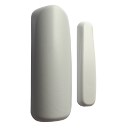

# Event forwarding

The document describes how Netlia system forwards events to the partner's application.

**The communication details are agreed between Netlia and the partner and set on the Netlia side.**

# Data transfer methods

Data is transmitted by a communication protocol in JSON format and describes events that occur in the NETLIA system.
Datetime entries are in UTC according to ISO 8601. The order of the parameters is not guaranteed and may change.

## Forwarding events by HTTP callback

Partner can specify the URLs of endpoints to which events are sent as HTTP(S) POST requests. Requests have UTF-8 encoding and Content-Type "application/json". The system tries to pass events in at-least-once mode, so there may be a situation where an event is delivered multiple times. This situation can be handled by using the `EventId` item, which contains
event identifier.

### HTTP request URL

It is possible to insert placeholders in the URL that will be replaced by the corresponding value.

| Parameter       | Description                    |
|:----------------|:-------------------------------|
| ProtocolVersion | communication protocol version |
| DeviceId        | device identifier              |
| DeviceType      | type of device                 |
| EventType       | type of event                  |

URL example (recommended settings):

`https://someaddress.com/event/v{ProtocolVersion}/{DeviceId}/{EventType}/`

For example, the following requests will be called for the specified URL:

https://someaddress.com/event/v1/abc123/event-start/

https://someaddress.com/event/v1/abc123/measured-humidity/

### HTTP request headers
Partner can specify additional configuration by adding an HTTP headers (key and value). This can, for example, solve authorization.

### Response for HTTP request

System expects 200-299 HTTP status in the response, which is used by partner to acknowledge receiving the event. Any other response is interpreted as a non-delivery.

### Event non-delivery handling
 If the event transfer fails, the system repeats the attempt 10 times with a 5s delay. The event is then dropped.

# Communication protocol
Data is always sent as separate events. Events have a common part of parameters.

Common parameters:

| Parameter       | Type    | Description                    |
|:----------------|:--------|:-------------------------------|
| ProtocolVersion | integer | communication protocol version |
| DeviceId        | string  | device identifier              |
| EventId         | string  | event identifier               |
| EventTime       | string  | time of event                  |
| DeviceType      | string  | type of device                 |
| EventType       | string  | type of event                  |

Other possible parameters not listed in the table depends on the type of message and event.

# Devices and supported event types

## WaterDetection device
Detects the presence of water in a defined area.


If flooding occurs in the idle state, the `event-start` event is triggered. It then checks every minute if the flooding continues and if it does, it fires the `event-continue` event after 10 minutes. If the flooding continues, it sends an `event-continue` event after another 10 minutes to indicate that the flooding continues. It does not send another. When the flooding ends the device sends `event-end`.

> DeviceType: water-detection

| EventType                                           | Description                                                                  |
|:----------------------------------------------------|:-----------------------------------------------------------------------------|
| [restart](#eventtype-restart)                       | Device restart.                                                              |
| [alive](#eventtype-alive)                           | Occurs at periodic intervals, confirming the functionality of the device.    |
| [transport](#eventtype-transport)                   | Switching to transport mode - inactive state with minimum power consumption. |
| [event-start](#eventtype-event-start)               | Detection of flooding.                                                       |
| [event-continue](#eventtype-event-continue)         | Flooding continues.                                                          |
| [event-end](#eventtype-event-end)                   | End of flooding.                                                             |

## MovementDetection device
Detects movement of the object on which the device is attached or placed. 


For cases when we want to be informed that an object has moved. For example - door, window, office drawer, bag, car, motorcycle, bicycle, stroller, backpack, suitcase...

If motion occurs in the idle state, the `event-start` event is triggered. If motion occurs in the following 10 minutes, it counts the repetition of motion and sends `event-continue` after 10 minutes. The `event-continue` repeats until movement continues. If the device is out of movement 10 minutes from the start or continued movement, it sends `event-end`.

> DeviceType: movement-detection

| EventType                                           | Description                                                                  |
|:----------------------------------------------------|:-----------------------------------------------------------------------------|
| [restart](#eventtype-restart)                       | Device restart.                                                              |
| [alive](#eventtype-alive)                           | Occurs at periodic intervals, confirming the functionality of the device.    |
| [transport](#eventtype-transport)                   | Switching to transport mode - inactive state with minimum power consumption. |
| [tamper](#eventtype-tamper)                         | Device enclosure opened or closed, safety switch manipulation.               |
| [event-start](#eventtype-event-start)               | Movement detected.                                                           |
| [event-continue](#eventtype-event-continue)         | Movement continues.                                                          |
| [event-end](#eventtype-event-end)                   | There was no movement for 10 minutes.                                        |

## Magnetic device
It detects that the magnet has detached from the device or approached the device.



### Simple mode

To identify that cabinets, windows, doors have been opened/closed or to identify that an object has moved away from another.

The `event-start` event is triggered whenever the magnet is detached. When the magnet is approached back, the `event-end` event is triggered.

> DeviceType: magnetic-detection-simple

| EventType                                           | Description                                                                  |
|:----------------------------------------------------|:-----------------------------------------------------------------------------|
| [restart](#eventtype-restart)                       | Device restart.                                                              |
| [alive](#eventtype-alive)                           | Occurs at periodic intervals, confirming the functionality of the device.    |
| [transport](#eventtype-transport)                   | Switching to transport mode - inactive state with minimum power consumption. |
| [tamper](#eventtype-tamper)                         | Device enclosure opened or closed, safety switch manipulation.               |
| [event-start](#eventtype-event-start)               | Magnet detached, start of alarm.                                             |
| [event-end](#eventtype-event-end)                   | Magnet approached, end of alarm.                                             |

### Continuous mode

To monitor the frequency of opening/closing of doors, covers, passing of moving parts.

If the magnet is disconnected in the idle state, the `event-start` event is triggered. No event is triggered for a magnet approach, but if the magnet is disconnected again within 10 minutes, the number of times it has been disconnected is counted and `event-continue` is sent after 10 minutes. The `event-continue` event repeats as long as the magnet manipulation continues. If nothing happens within 10 minutes (the magnet does not detach), the device sends `event-end`.

> DeviceType: magnetic-detection-continuous

| EventType                                           | Description                                                                  |
|:----------------------------------------------------|:-----------------------------------------------------------------------------|
| [restart](#eventtype-restart)                       | Device restart.                                                              |
| [alive](#eventtype-alive)                           | Occurs at periodic intervals, confirming the functionality of the device.    |
| [transport](#eventtype-transport)                   | Switching to transport mode - inactive state with minimum power consumption. |
| [tamper](#eventtype-tamper)                         | Device enclosure opened or closed, safety switch manipulation.               |
| [event-start](#eventtype-event-start)               | Magnet detached, start of alarm.                                             |
| [event-continue](#eventtype-event-continue)         | Magnet manipulation repeats, alarm continues.                                |
| [event-end](#eventtype-event-end)                   | Magnet hasn't been detached for 10 minutes, end of alarm.                    |

## Pir device
Detects person movement or presence in a specified area up to 10 meters distance. 


To identify that a person is moving in a room or restricted area, when and how often.

When the device detects person movemenet, it trigger `event-start` event. If movement detection continues, device sends in 10
minute intervals `event-continue` event messages indicating that movement continues, count, and when occurred the last one. Device sends an `event-end` event message if no movement is detected for 10 minutes.

> DeviceType: pir

| EventType                                           | Description                                                                  |
|:----------------------------------------------------|:-----------------------------------------------------------------------------|
| [restart](#eventtype-restart)                       | Device restart.                                                              |
| [alive](#eventtype-alive)                           | Occurs at periodic intervals, confirming the functionality of the device.    |
| [transport](#eventtype-transport)                   | Switching to transport mode - inactive state with minimum power consumption. |
| [tamper](#eventtype-tamper)                         | Device enclosure opened or closed, safety switch manipulation.               |
| [event-start](#eventtype-event-start)               | Movement detected.                                                           |
| [event-continue](#eventtype-event-continue)         | Movement continues.                                                          |
| [event-end](#eventtype-event-end)                   | There was no movement for 10 minutes.                                        |

## AlertButton device
Device with a button to call for help or raise an alarm.


The device trigger `event-start` evebt when the button is pressed.

> DeviceType: event-button

| EventType                             | Description                                                                  |
|:--------------------------------------|:-----------------------------------------------------------------------------|
| [restart](#eventtype-restart)         | Device restart.                                                              |
| [alive](#eventtype-alive)             | Occurs at periodic intervals, confirming the functionality of the device.    |
| [transport](#eventtype-transport)     | Switching to transport mode - inactive state with minimum power consumption. |
| [event-start](#eventtype-event-start) | Pressed, alarm started .                                                     |

## Thermometer device
Measures the ambient temperature.


Device measures the temperature every minute. After X measurements, it calculates the average value and sends a `measured-temperature` event.

> DeviceType: thermometer-average

| EventType                                               | Description                                                                  |
|:--------------------------------------------------------|:-----------------------------------------------------------------------------|
| [restart](#eventtype-restart)                           | Device restart.                                                              |
| [alive](#eventtype-alive)                               | Occurs at periodic intervals, confirming the functionality of the device.    |
| [transport](#eventtype-transport)                       | Switching to transport mode - inactive state with minimum power consumption. |
| [measured-temperature](#eventtype-measured-temperature) | Measured values.                                                             |

### EventType measured-temperature

Triggered when the measured value is sent.

Additional parameters:

| Parameter   | Type  | Mandatory | Description          |
|:------------|:------|:----------|:---------------------|
| Temperature | float | yes       | measured temperature |

A sample of the sent event:

```yaml
{
    "ProtocolVersion": 1,
    "DeviceId": "abc123",
    "DeviceType": "thermometer-average",
    "EventId": "c4056fc4-d433-4d2c-bb7f-23a691fd3dac",
    "EventTime": "2021-05-03T14:25:31.8437511Z",
    "EventType": "measured-temperature",
    "Temperature": 25.5
}
```

## HumidityMeter device
Measures ambient temperature and humidity.


Device measures the temperature and humidity every minute. After X measurements, it calculates the average value and sends a `measured-humidity-temperature` event.

> DeviceType: humidity-meter-average

| EventType                                                                 | Description                                                                  |
|:--------------------------------------------------------------------------|:-----------------------------------------------------------------------------|
| [restart](#eventtype-restart)                                             | Device restart.                                                              |
| [alive](#eventtype-alive)                                                 | Occurs at periodic intervals, confirming the functionality of the device.    |
| [transport](#eventtype-transport)                                         | Switching to transport mode - inactive state with minimum power consumption. |
| [measured-humidity-temperature](#eventtype-measured-humidity-temperature) | Measured values.                                                             |

### EventType measured-humidity-temperature

Triggered when the measured value is sent.

Additional parameters:

| Parameter   | Type  | Mandatory | Description          |
|:------------|:------|:----------|:---------------------|
| Temperature | float | yes       | measured temperature |
| Humidity    | float | yes       | measured humidity    |

A sample of the sent event:

```yaml
{
    "ProtocolVersion": 1,
    "DeviceId": "abc123",
    "DeviceType": "humidity-meter-average",
    "EventId": "c4056fc4-d433-4d2c-bb7f-23a691fd3dac",
    "EventTime": "2021-05-03T14:25:31.8437511Z",
    "EventType": "measured-humidity-temperature",
    "Temperature": 25.5,
    "Humidity": 27.5
}
```

# Common events

Events referenced from specific message types.

## EventType restart
Occurs when the device restarts. A restart can be caused by pressing a restart button located on the device's PCB, or a restart can be triggered by firmware during a hardware error or by some device configuration changes using a downlink command sent through the downlink API.

A sample of the sent event:
```yaml
{
    "ProtocolVersion": 1,
    "DeviceId": "abc123",
    "DeviceType": "magnetic-detection-simple",
    "EventId": "c4056fc4-d433-4d2c-bb7f-23a691fd3dac",
    "EventTime": "2021-05-03T14:25:31.8437511Z",
    "EventType": "restart"
}
```

## EventType alive
Occurs at periodic intervals, confirming the functionality of the device.

A sample of the sent event:
```yaml
{
    "ProtocolVersion": 1,
    "DeviceId": "abc123",
    "DeviceType": "magnetic-detection-simple",
    "EventId": "c4056fc4-d433-4d2c-bb7f-23a691fd3dac",
    "EventTime": "2021-05-03T14:25:31.8437511Z",
    "EventType": "alive"
}
```

## EventType transport

Occurs when the device enters transport mode, which happens when a new battery is inserted or by using the command
sent through the downlink API.

The device in transport mode has very low power consumption and sends no messages. To wake up the device from transport mode
the RESET button located on the PCB must be pressed.

A sample of the sent event:
```yaml
{
    "ProtocolVersion": 1,
    "DeviceId": "abc123",
    "DeviceType": "magnetic-detection-simple",
    "EventId": "c4056fc4-d433-4d2c-bb7f-23a691fd3dac",
    "EventTime": "2021-05-03T14:25:31.8437511Z",
    "EventType": "transport"
}
```

[//]: # (## EventType downlink-acknowledge)

[//]: # (Informuje o doručení downlinkového commandu na zařízení.)

[//]: # ()

[//]: # (Ukázka zaslané události:)

[//]: # (```yaml)

[//]: # ({)

[//]: # (    "ProtocolVersion": 1,)

[//]: # (    "DeviceId": "abc123",)

[//]: # (    "DeviceType": "magnetic-detection-simple",)

[//]: # (    "EventId": "c4056fc4-d433-4d2c-bb7f-23a691fd3dac",)

[//]: # (    "EventTime": "2021-05-03T14:25:31.8437511Z",)

[//]: # (    "EventType": "downlink-acknowledge")

[//]: # (})

[//]: # (```)

## EventType tamper

Occurs when the device enclosure is opened or closed, or the safety switch is manipulated.

A sample of the sent event:

```yaml
{
    "ProtocolVersion": 1,
    "DeviceId": "abc123",
    "DeviceType": "magnetic-detection-simple",
    "EventId": "c4056fc4-d433-4d2c-bb7f-23a691fd3dac",
    "EventTime": "2021-05-03T14:25:31.8437511Z",
    "EventType": "tamper"
}
```

## EventType event-start
It is triggered by the first occurrence of an event such as flooding of the contacts, a magnet detachment or registration of movement.

A sample of the sent event:
```yaml
{
    "ProtocolVersion": 1,
    "DeviceId": "abc123",
    "DeviceType": "magnetic-detection-simple",
    "EventId": "c4056fc4-d433-4d2c-bb7f-23a691fd3dac",
    "EventTime": "2021-05-03T14:25:31.8437511Z",
    "EventType": "event-start"
}
```

## EventType event-continue
Occurs when the event continues.

A sample of the sent event:

```yaml
{
    "ProtocolVersion": 1,
    "DeviceId": "abc123",
    "DeviceType": "movement-detection",
    "EventId": "c4056fc4-d433-4d2c-bb7f-23a691fd3dac",
    "EventTime": "2021-05-03T14:25:31.8437511Z",
    "EventType": "event-continue",
    "EventCount": 0,
    "SecondsSinceLastEvent": 0
}
```

The `EventCount` specifies the number of event repetitions since the last `event-start` or `event-continue` was sent.

`SecondsSinceLastEvent` specifies the number of seconds between the last event and the sending of the message.

## EventType event-end
Occurs at the end of the event. The situation when event end occurs is described for each device that supports this functionality.

A sample of the sent event:
```yaml
{
    "ProtocolVersion": 1,
    "DeviceId": "abc123",
    "DeviceType": "magnetic-detection-simple",
    "EventId": "c4056fc4-d433-4d2c-bb7f-23a691fd3dac",
    "EventTime": "2021-05-03T14:25:31.8437511Z",
    "EventType": "event-end"
}
```
